# I. Aluminium frame

## Components

| Code | Part | Qty | 3D object | Metal change |
|------|------|-----|-----------|--------------|
| O07  | Aluminium profile 900×30×30 mm (depth beams) | 4 | `Frame_Lo/Up_Left/Right_Y` | unchanged |
| O04  | Aluminium profile 677×30×30 mm (width cross-beams) | 4 | `Frame_Lo/Up_Front/Back_X` | unchanged |
| O06  | Aluminium profile 80×30×30 mm (vertical spacers) | 8 | `Frame_Vert_*` | unchanged |
| O21  | MGN12H linear rail 600 mm (Y-axis) | 2 | `Rail_Y_Left`, `Rail_Y_Right` | unchanged |
| T03  | M8×717 mm threaded rod (frame tie rods) | 4 | — | unchanged |
| T02  | M8×120 mm threaded rod (vertical tie rods) | 8 | — | unchanged |
| S03  | M3×16 mm screw (rail mounting) | 48 | — | unchanged |
| N03  | M8 lock nut | 24 | — | unchanged |
| W04  | Washer 20×10×2 mm | 24 | — | unchanged |
| P25  | Rail support alignment tool (3D-printed) | 3 | — | unchanged |

No metal modifications in this section. Follow the plastic build instructions exactly.

## 3D view — stage 1

Stage 1 (frames 0–7) in the staged GIF: frame profiles and Y-rails assembling.

> Per-stage sub-GIF (frames 0–7 only) planned — RR-04.

## Drill holes in 900 mm profiles

The main frame is two separate frames (lower and upper) tied together with threaded rods. Holes are drilled through the 900 mm profiles (**O07**) for the rods to pass through.

Mark hole positions with a sharpie and set square. Make centre indentations with a bradawl and hammer.

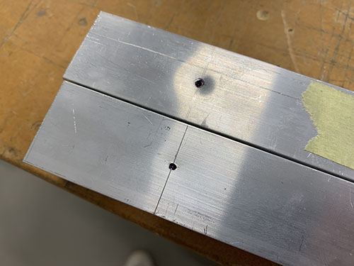

Drill straight through with a 9 mm bit on a bench drill.

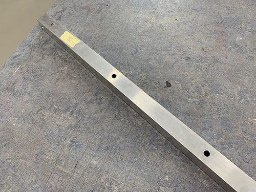

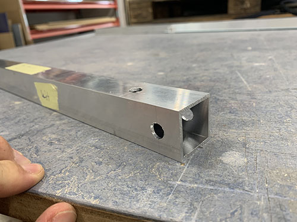

Some outward-facing holes need enlarging to 20 mm so a socket wrench can reach the nuts. Mark them with a sharpie, then use a step drill. Tip: put a small piece of masking tape on the step above your target step so you can see the target depth.

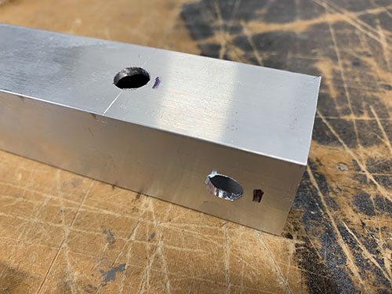

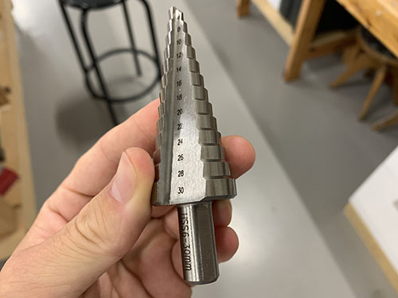

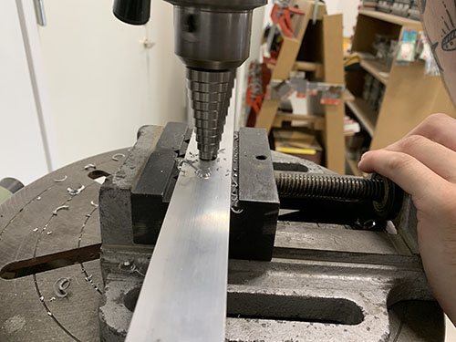

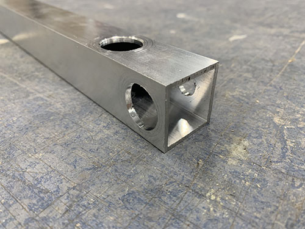

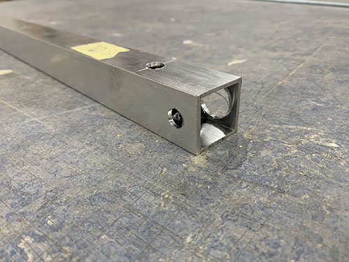

Smooth all edges with a round metal file.

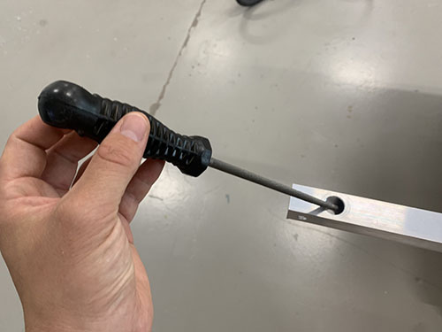

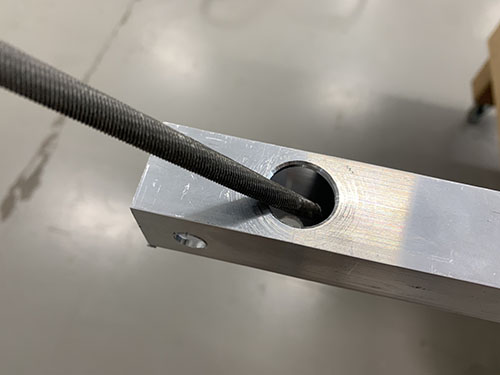

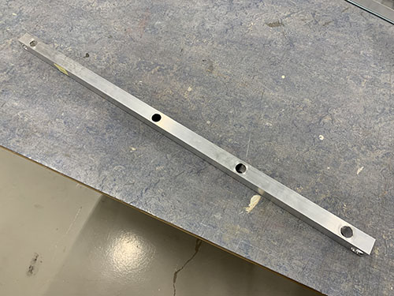

## Rails to 900 mm profiles

Two 600 mm MGN12H rails (**O21**) are attached to the **upper** frame 900 mm profiles before assembly — on the faces pointing outward and above the 80 mm vertical spacers. Carefully remove the MGN12H blocks (**O22**) from the rails first.

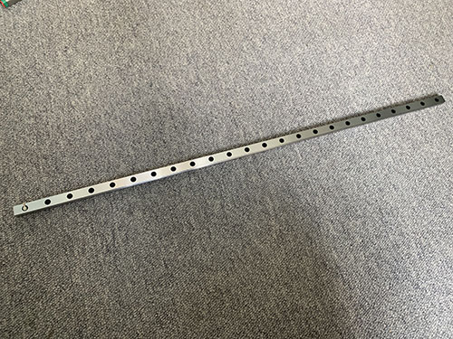

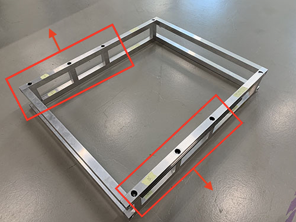

Use 3× 3D-printed support tools (**P25**) to centre the rails on the profiles. A 57 mm wooden block sets the distance from the profile ends. Clamp everything in place.

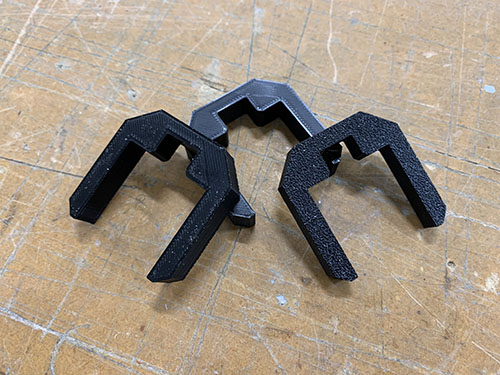

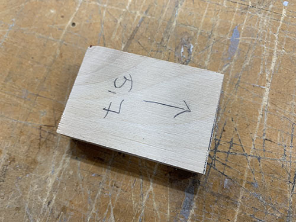

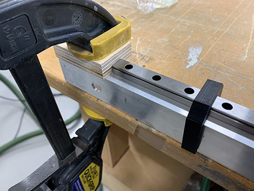

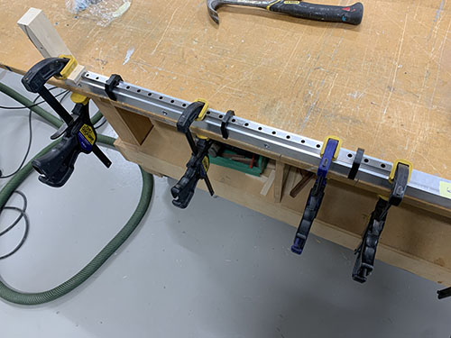

Centre-punch each hole position with a bradawl. Apply cutting fluid and drill 2 mm pilot holes.

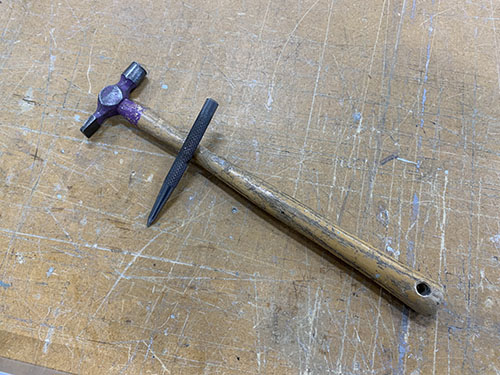

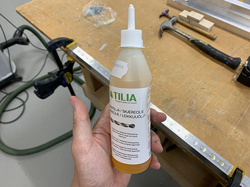

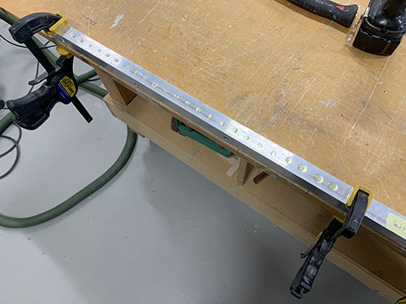

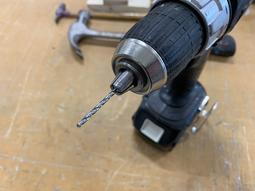

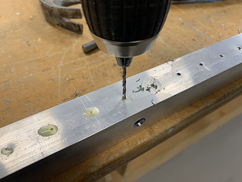

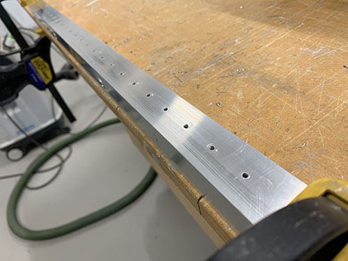

Apply cutting fluid again and run the M3 tap through each hole.

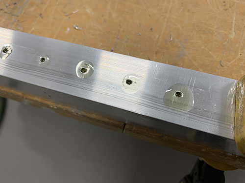

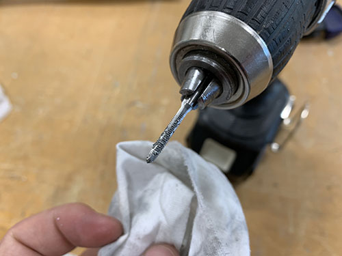

Attach rails with 48× M3×16 mm screws (**S03**).

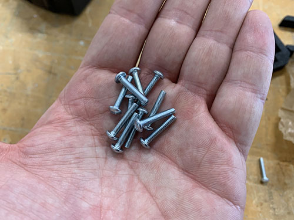

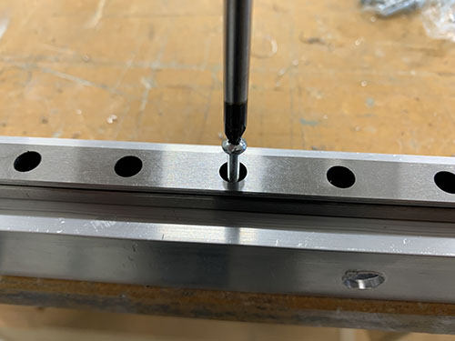

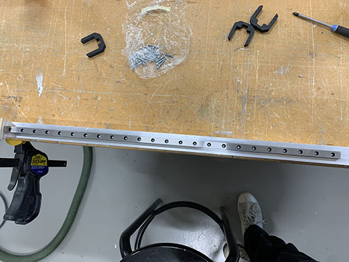

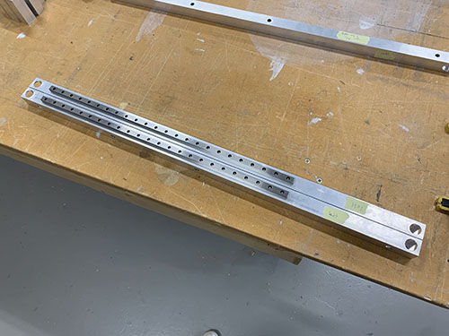

## Assemble upper and lower frames

Connect the two frames with 4× M8×717 mm threaded rods (**T03**), 8× washers (**W04**), and 8× M8 lock nuts (**N03**). Use two spanners or socket wrenches, one on each side.

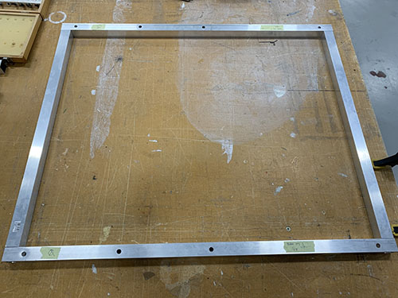

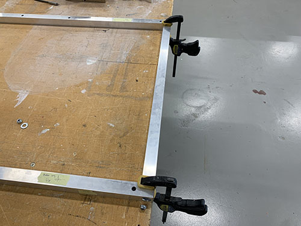

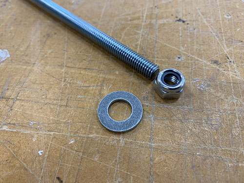

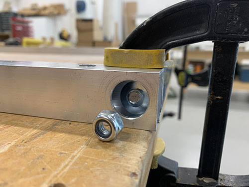

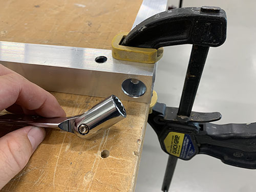

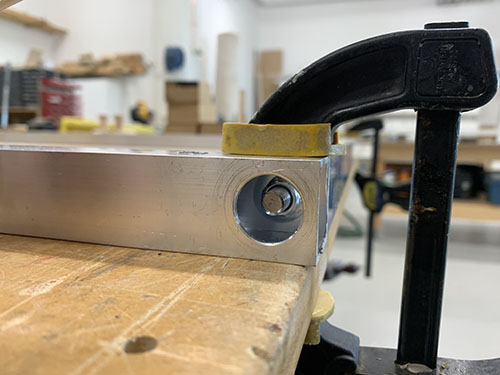

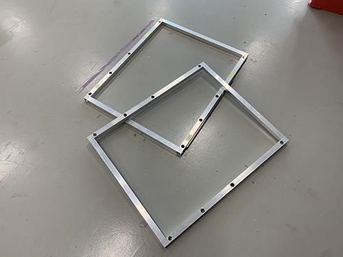

## Interlock upper and lower frames

Lay out the 8× 80 mm vertical spacers (**O06**) between the two frames. Use the bridge beams (**O05**) and clamps to hold alignment.

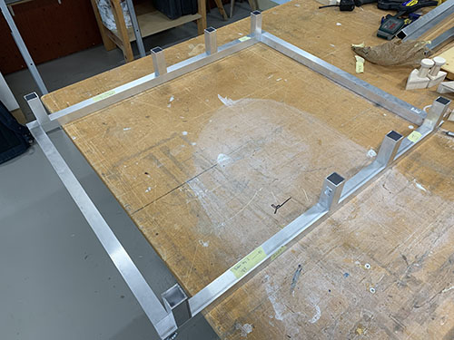

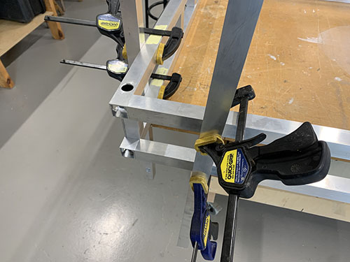

Thread 8× M8×120 mm rods (**T02**), 16× washers (**W04**), and 16× M8 lock nuts (**N03**) through the vertical spacers to interlock the two frames.

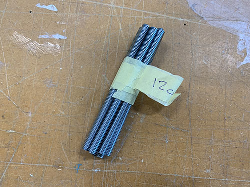

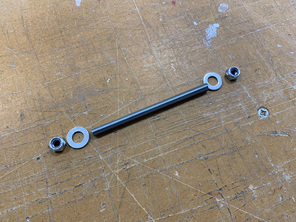

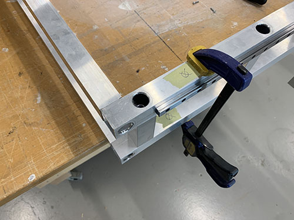

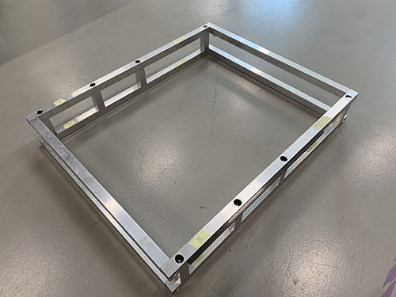

---

*Next: [II. Side plates & Y-axis](02-side-plates.md)*
