# III. Gantry & X-axis

Three 803 mm aluminium bridge beams (**O05**) form the gantry. Two of the three carry MGN12H linear rails (**O21**) for the X-axis carriage. The HTD5M belt (**O17**) drives the carriage across the gantry via the X-axis stepper motor (**E18**). The engine sideways belt clamp (**MX.1**) guides the HTD5M belt along the correct path as the carriage moves.

## Components

| Code | Part | Qty | 3D object | Metal change |
|------|------|-----|-----------|--------------|
| O05  | Aluminium profile 803×30×30 mm (bridge beams) | 3 | `Gantry_Beam_Upper1`, `Gantry_Beam_Upper2`, `Gantry_Beam_Lower` | unchanged |
| O21  | MGN12H linear rail 600 mm (X-axis) | 2 | `Rail_X_Upper`, `Rail_X_Lower` | unchanged |
| O22  | MGN12H rail block (4× X-axis) | 4 | — | unchanged |
| MX.1 | engine sideways belt clamp | 1 | `Engine_Sideways_Belt_Clamp` | **new metal** (no plastic equivalent) |
| P07  | Carriage (3D-printed) | 1 | — | unchanged |
| O19  | KFL08 rod bearing 8 mm | 2 | — | unchanged |
| E18  | Geared NEMA17 stepper motor (1:19, 8 mm shaft, X-axis) | 1 | — | unchanged |
| O18  | HTD5M pulley 12T 8 mm bore 15 mm wide | 1 | — | unchanged |
| O17  | HTD5M belt 15 mm wide | ~2 m | — | unchanged |
| O01  | 698zz bearing | 6 | — | unchanged |
| P16  | Idler block (3D-printed) | 1 | — | unchanged |
| P28  | Right fixed belt tensioner (3D-printed) | 1 | — | unchanged |
| P27  | Right belt tensioner (3D-printed) | 1 | — | unchanged |
| P08  | End-stop mount ordinary (3D-printed) | 1 | — | unchanged |
| P38  | X-axis cable chain mount (3D-printed) | 1 | — | unchanged |
| P05  | Y-axis cable chain mount (3D-printed) | 1 | — | unchanged |
| P06  | Y-axis cable chain support (3D-printed) | 1 | — | unchanged |
| O09  | Cable chain 30×15 mm inner | 2 | — | unchanged |
| S03  | M3×16 mm screw (rail to beam) | 32 | — | unchanged |
| S05  | M3×25 mm screw (carriage to blocks) | 16 | — | unchanged |
| S12  | M5×20 mm screw (tensioner, end-stop, cable chain) | 8 | — | unchanged |
| S10  | M4×25 mm screw (cable chain mounts) | 7 | — | unchanged |
| N01  | M4 nut | 5 | — | unchanged |
| W01  | Washer 10×5×1 mm | 5 | — | unchanged |

## 3D view — stage 3

Stage 3 (frames 16–23) in the staged GIF: gantry bridge beams and X-rails assembling.

`cnc_assembly_staged_gif`

> Per-stage sub-GIF (frames 16–23 only) planned — RR-04.

## Component plan view — MX.1

MX.1 is a new metal part with no plastic equivalent.

| Part | Plan view |
|------|-----------|
| MX.1 — engine sideways belt clamp | 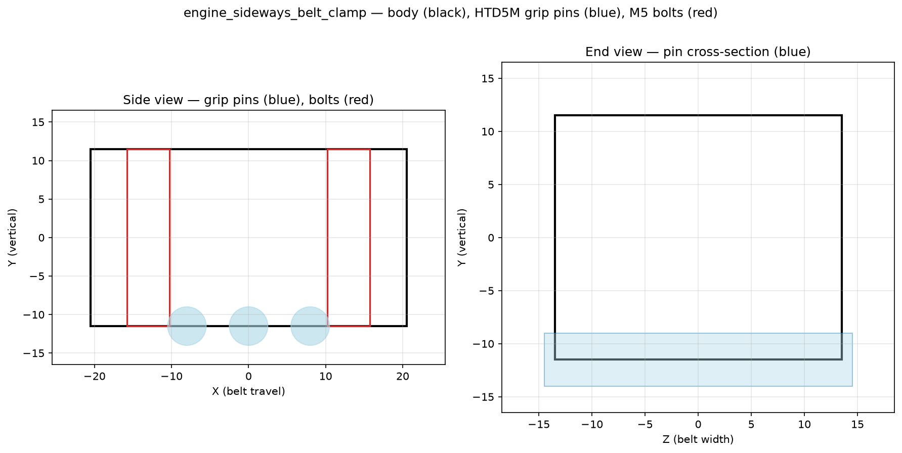 `MX1_plan` |

## Rails to bridge beams

Remove the MGN12H blocks (**O22**) from the two 600 mm rails. Align each rail 100 mm from the beam end — the same offset used for the Y-rails. Use the 3D-printed support tools (**P25**) to centre the rails on the beams. Note the rails are 3 mm off-centre; keep track of which face they go on so the rails line up when the beams are fitted to the side plates.

`attach_rails_to_beams_1`
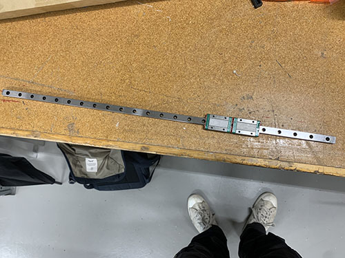

`attach_rails_to_beams_2`
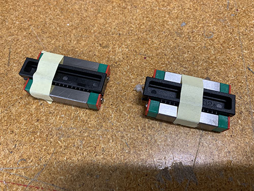

`attach_rails_to_beams_3`
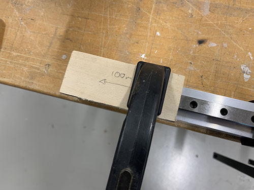

`attach_rails_to_beams_4`
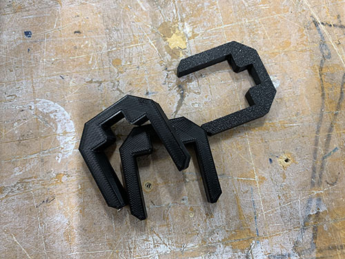

`attach_rails_to_beams_5`
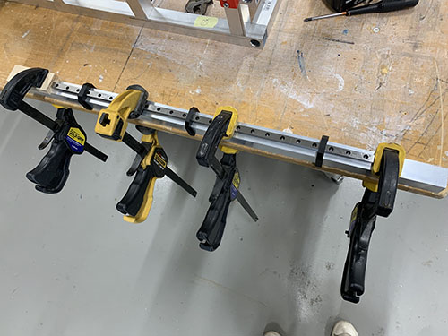

`attach_rails_to_beams_6`
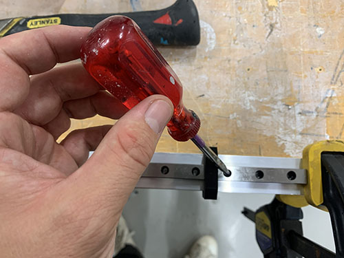

`attach_rails_to_beams_7`
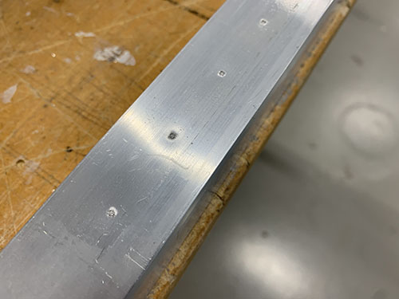

`attach_rails_to_beams_8`
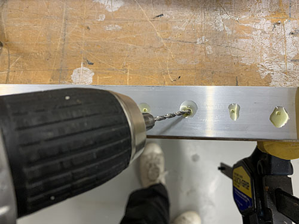

`attach_rails_to_beams_9`
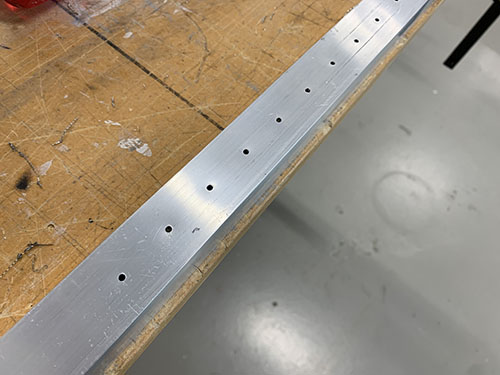

`attach_rails_to_beams_10`
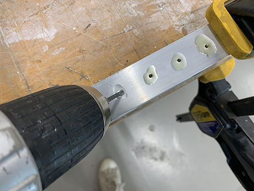

`attach_rails_to_beams_11`
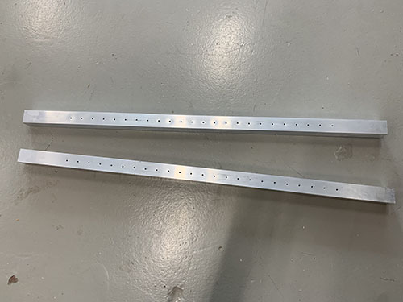

Fix rails with 16× M3×16 mm screws (**S03**). Slide MGN12H blocks back onto the rails.

`attach_rails_to_beams_12`
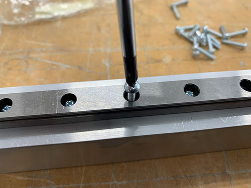

`attach_rails_to_beams_13`
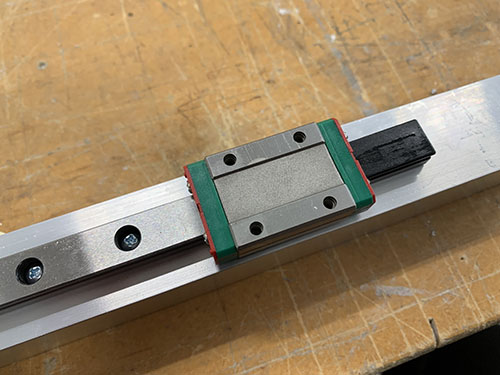

`attach_rails_to_beams_14`
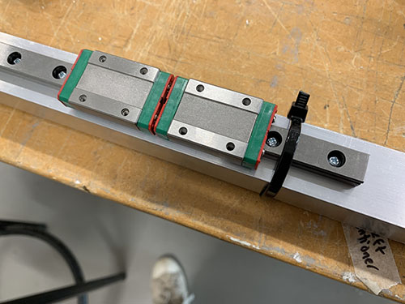

`attach_rails_to_beams_15`
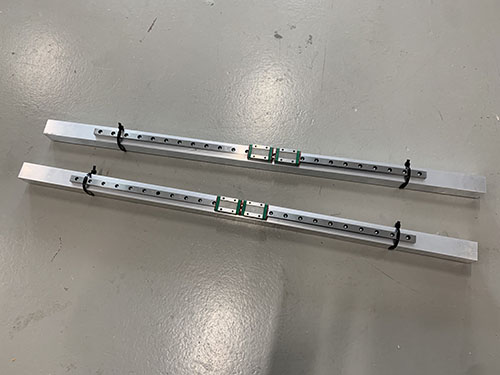

## X-axis tensioner and end-stop mount to lower bridge beam

Attach the fixed tensioner (**P28**) and end-stop mount (**P08**) to the lower bridge beam with 4× M5×20 mm screws (**S12**). Orient so the belt opening faces the rail direction. Centre-punch, drill 4 mm, tap M5.

`attach_tensioners_to_beams_1`
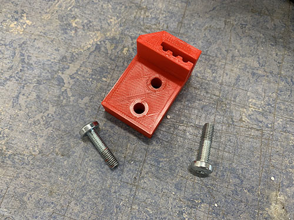

`attach_tensioners_to_beams_2`
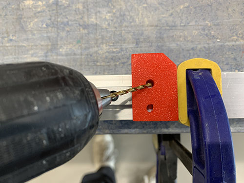

`attach_tensioners_to_beams_3`
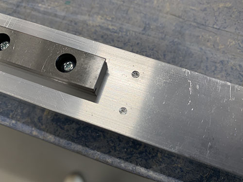

`attach_tensioners_to_beams_4`
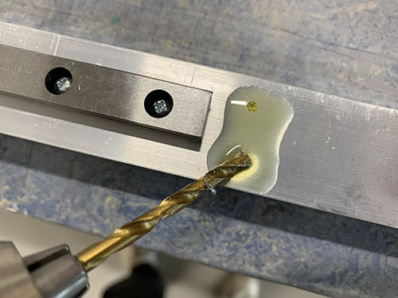

`attach_tensioners_to_beams_5`
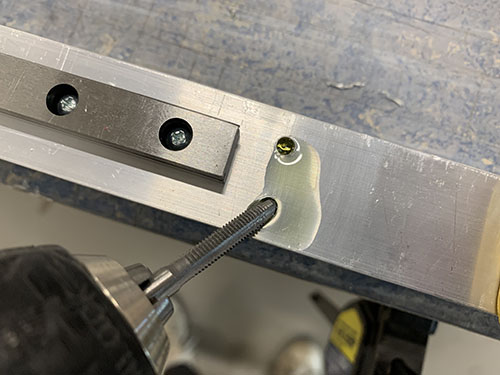

`attach_tensioners_to_beams_6`
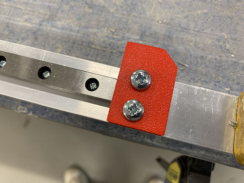

`attach_tensioners_to_beams_7`
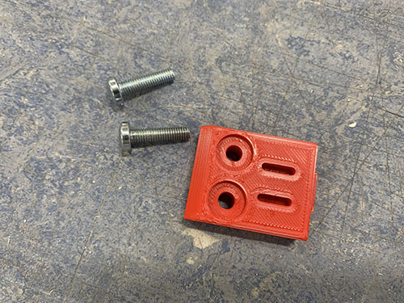

`attach_tensioners_to_beams_8`
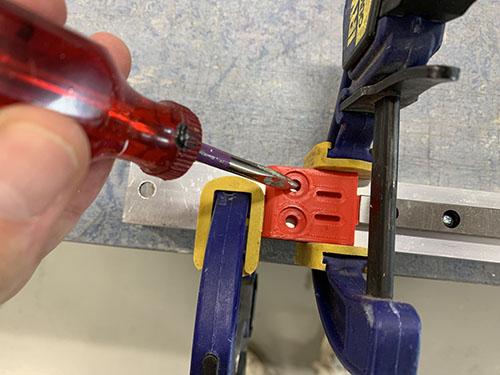

`attach_tensioners_to_beams_9`
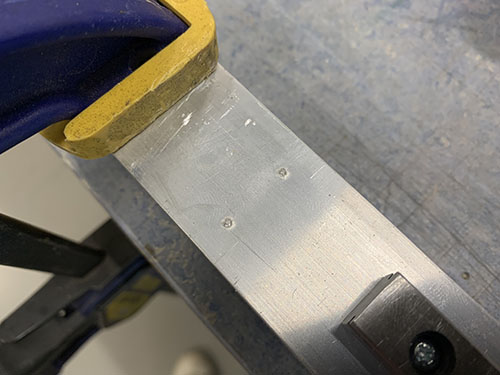

`attach_tensioners_to_beams_10`
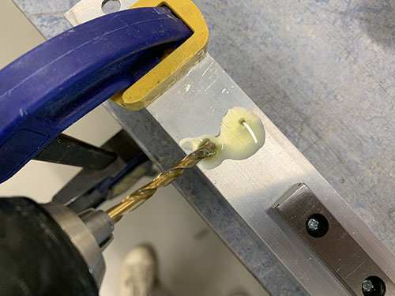

`attach_tensioners_to_beams_11`
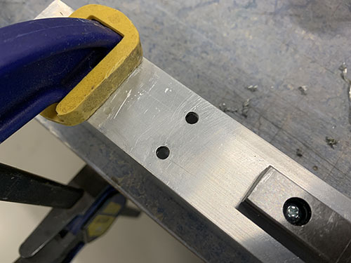

`attach_tensioners_to_beams_12`
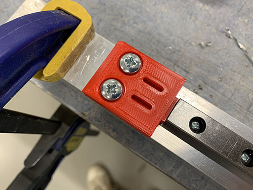

## Bridge beams to side plates

Insert all 3 bridge beams (**O05**) into the slots on M20.a / M29.a. The two beams with rails go on top of each other with rails pointing outward. Insert them in the correct orientation so the rails line up (the 3 mm off-centre offset means orientation matters).

`attach_beams_to_side_plates_1`
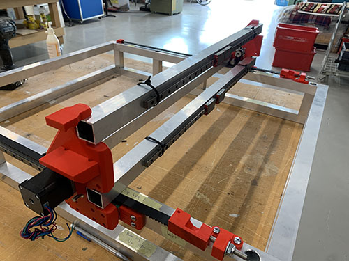

`attach_beams_to_side_plates_2`
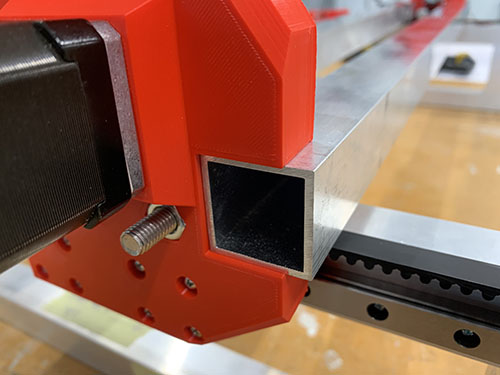

`attach_beams_to_side_plates_3`
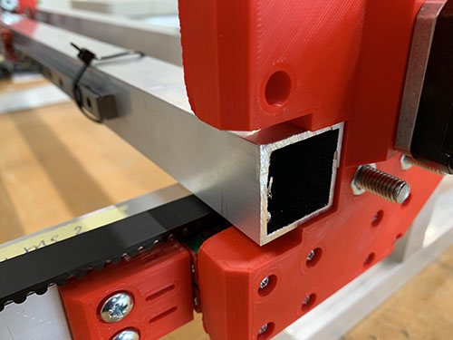

`attach_beams_to_side_plates_4`
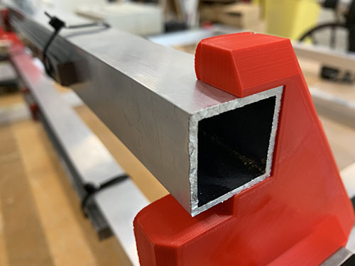

With beams aligned, place the metal blocker clips (M20.b/c/d and M29.b/c/d) and mark hole centres with a sharpie. Centre-punch, then drill 7 mm through-holes using a bench drill. Remove all excess metal with a file.

`attach_beams_to_side_plates_5`
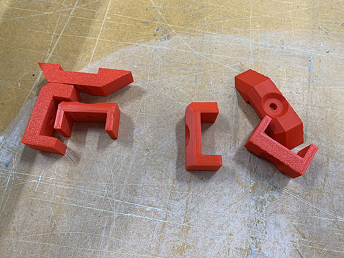

`attach_beams_to_side_plates_6`
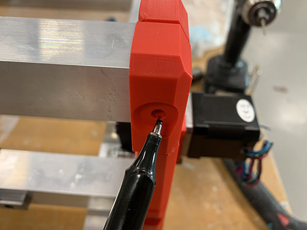

`attach_beams_to_side_plates_7`
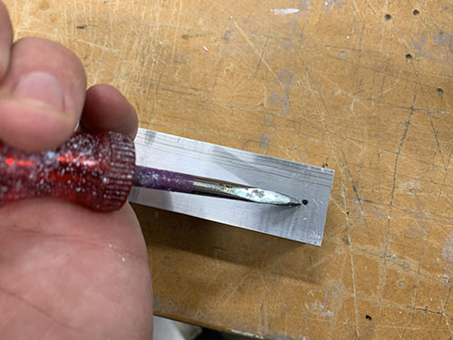

`attach_beams_to_side_plates_8`
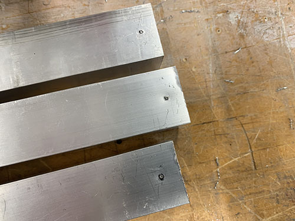

`attach_beams_to_side_plates_9`
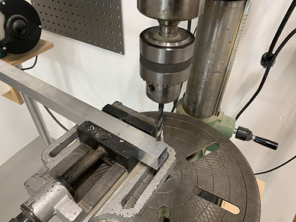

`attach_beams_to_side_plates_10`
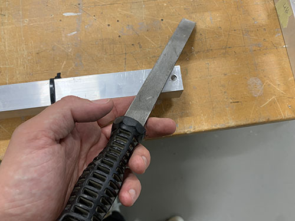

Reinsert beams with all metal clips. Thread 2× M5×140 mm rods (**T01**) through the two lower beams and 2× M5×60 mm screws (**S14**) through the top beam. Tighten with M5 nuts (**N02**).

`attach_beams_to_side_plates_11`
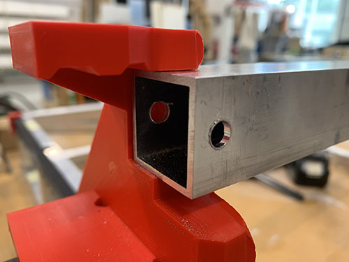

`attach_beams_to_side_plates_12`
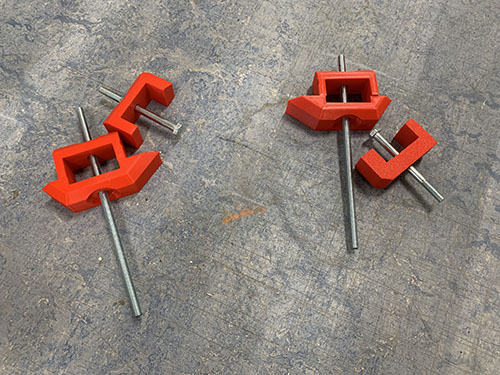

`attach_beams_to_side_plates_13`
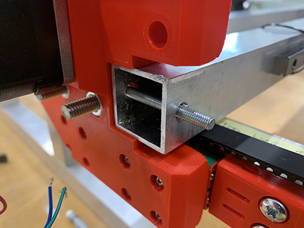

`attach_beams_to_side_plates_14`
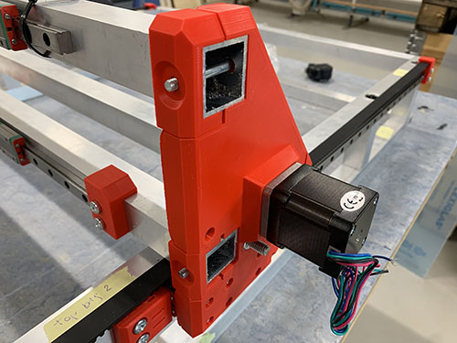

`attach_beams_to_side_plates_15`
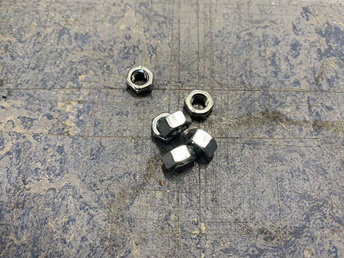

`attach_beams_to_side_plates_16`
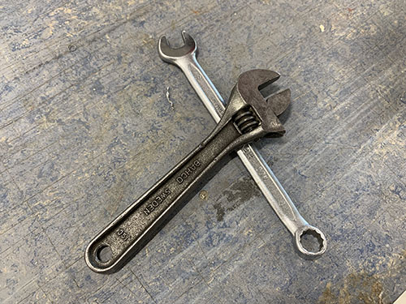

`attach_beams_to_side_plates_17`
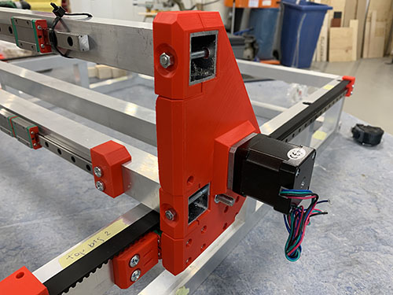

## Rod bearings to carriage

Attach 2× KFL08 rod bearings (**O19**) inside the 3D-printed carriage (**P07**) at top and bottom, using 4× M5×20 mm screws (**S12**) and M5 nuts (**N02**). Tip: temporarily thread the acme rod through both bearings to align them vertically before tightening.

`assemble_carriage_1`
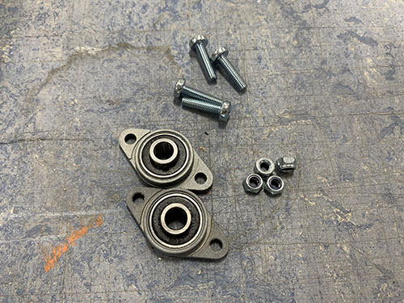

`assemble_carriage_2`
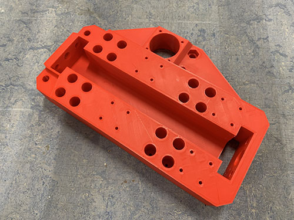

`assemble_carriage_3`
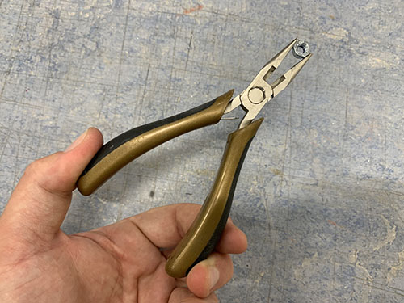

`assemble_carriage_4`
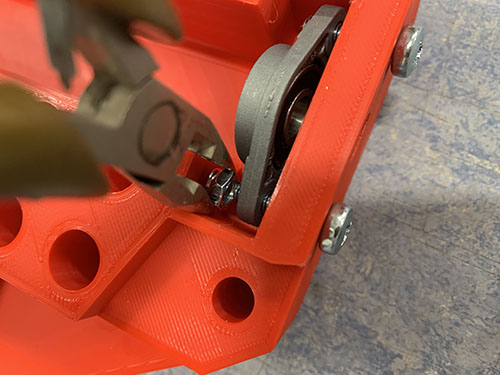

`assemble_carriage_5`
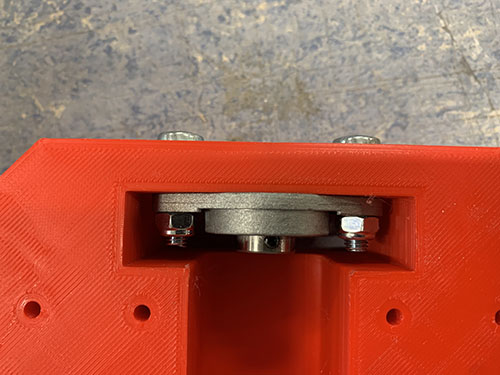

## Carriage to bridge beams

Attach the carriage (**P07**) to the 4× MGN12H blocks on the bridge beams with 16× M3×25 mm screws (**S05**).

`attach_carriage_to_beams_1`

`attach_carriage_to_beams_2`

`attach_carriage_to_beams_3`

`attach_carriage_to_beams_4`

## X-axis motor, idlers and pulley

Each X-axis idler: 1× M8×60 mm screw (**S15**), 3× 698zz bearing (**O01**), 4× washer (**W03**). Attach to the carriage with M8 nuts (**N03**). Bearings must spin freely.

`attach_side_plate_motors_1`

`attach_side_plate_motors_2`

`attach_idlers_motor_to_carriage_2`

`attach_idlers_motor_to_carriage_3`

`attach_idlers_motor_to_carriage_4`

`attach_idlers_motor_to_carriage_5`

Remove the 4× M3 screws locking the gearbox to the X-axis motor body.

`attach_idlers_motor_to_carriage_6`

`attach_idlers_motor_to_carriage_7`

`attach_idlers_motor_to_carriage_8`

Insert the X-axis geared stepper motor (**E18**) into the large hole on the carriage, cables facing upward. Fix with 4× M3×40 mm screws (**S06**) and washers (**W05**). Attach 1× HTD5M pulley (**O18**) to the shaft with set screws.

`attach_idlers_motor_to_carriage_9`

`attach_idlers_motor_to_carriage_10`

`attach_idlers_motor_to_carriage_11`

`attach_idlers_motor_to_carriage_12`

`attach_idlers_motor_to_carriage_13`

## X-axis HTD5M belt

Insert the HTD5M belt (**O17**) into the fixed tensioner, thread below the first idler, around the motor pulley, below the second idler, to the far end. Cut to length and insert into belt tensioner (**P27**). Attach the tensioner to the side plate with 1× M8×60 mm screw (**S15**), M8 nut (**N03**), and washer (**W04**). Belt should be firm but not over-tight.

`attach_x_axis_belt_1`

`attach_x_axis_belt_2`

`attach_x_axis_belt_3`

`attach_x_axis_belt_4`

`attach_x_axis_belt_5`

`attach_x_axis_belt_6`

`attach_x_axis_belt_7`

`attach_x_axis_belt_8`

## Y-axis cable chain

Attach the cable chain mount (**P05**) to the left side of the lower frame, aligned with the last vertical beam. Centre-punch, drill 4 mm, tap M5. Fix with 2× M5×20 mm screws (**S12**).

`assemble_cable_support_y_axis_1`

`assemble_cable_support_y_axis_2`

`assemble_cable_support_y_axis_3`

`assemble_cable_support_y_axis_4`

`assemble_cable_support_y_axis_5`

Attach the cable chain support (**P06**) centred between the second and third vertical beams. It must not hang below the bottom frame.

`assemble_cable_support_y_axis_6`

`assemble_cable_support_y_axis_6_1`

`assemble_cable_support_y_axis_7`

`assemble_cable_support_y_axis_8`

`assemble_cable_support_y_axis_9`

`assemble_cable_support_y_axis_10`

`assemble_cable_support_y_axis_11`

Clip the Y-axis cable chain (**O09**) to the left side plate and the lower frame support using 4× M4×25 mm screws (**S10**), M4 nuts (**N01**), and washers (**W01**).

`assemble_cable_support_y_axis_12`

`assemble_cable_support_y_axis_13`

`assemble_cable_support_y_axis_14`

`assemble_cable_support_y_axis_15`

`assemble_cable_support_y_axis_16`

`assemble_cable_support_y_axis_17`

---

*Next: [IV. Engine plate p1of2](04-engine-plate-p1of2.md)*
