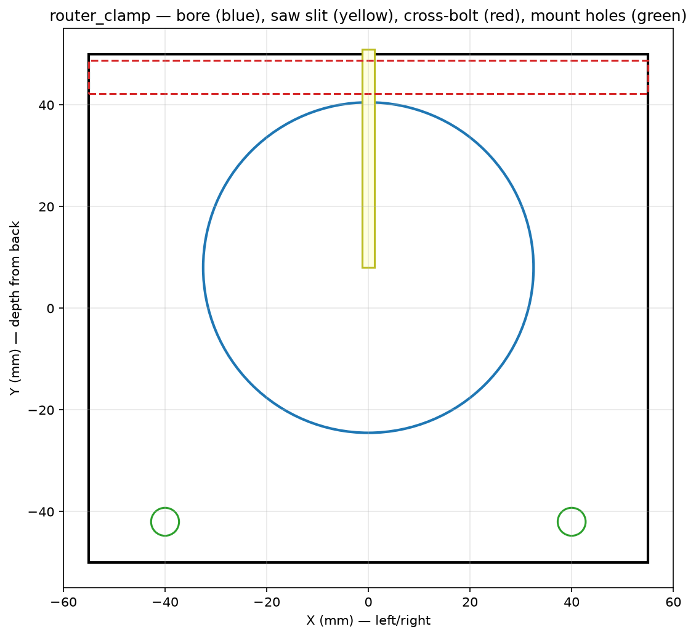
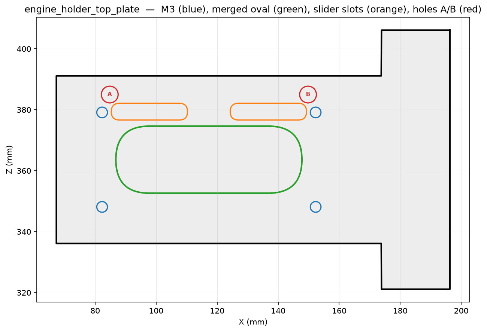

# Metal — X-axis and Z-axis

## Metal components

| M-code | Human name | Replaces | Script object | Status |
|--------|-----------|----------|---------------|--------|
| M36.a | vertical plate p1of2 — gantry-fixed back plate | P07 (Z-face) | `Engine_Holder_P1` | **metal** |
| M36.b | vertical plate p2of2 — sliding front plate | P36 | `Engine_Holder_P2` | **metal** |
| M40.a | engine holder top plate — stepper motor holder | P40 | `Top_Stepper_Holder` | **metal** |
| M24.a | router clamp — bottom half | P24 (part) | `Router_Clamp_Bottom` | **metal** |
| M24.b | router clamp — top half | P24 (part) | `Router_Clamp_Top` | **metal** |
| MX.1  | engine sideways belt clamp | — (new) | `Engine_Sideways_Belt_Clamp` | **metal** (no plastic equivalent) |
| O05 | Aluminium profile 803×30×30 mm (bridge beams) | — | `Gantry_Beam_*` | unchanged |
| O21 | MGN12H linear rail 600 mm (X-axis) | — | `Rail_X_Upper/Lower` | unchanged |
| O22 | MGN12H block (4× X-axis + 4× Z-axis) | — | `MGN12H_Block_*` | unchanged |
| O20 | MGN12H linear rail 200 mm (Z-axis vertical) | — | `Rail_Z_Left/Right` | unchanged |
| O02 | Acme rod 300 mm | — | — | unchanged |
| O03 | Acme nut | — | — | unchanged |
| E11 | NEMA17 stepper motor (no gear, Z-axis) | — | — | unchanged |
| O14 | GT2 belt | — | — | unchanged |
| O15 | GT2 pulley 16T | — | — | unchanged |
| O16 | GT2 pulley 60T | — | — | unchanged |
| P07 | Carriage (3D-printed body, X-motor/idler mount) | — | — | unchanged |
| O19 | KFL08 rod bearing | — | — | unchanged |

## Assembly GIF — stages 3 and 4

The staged assembly GIF shows:
- **Stage 3** (frames 16–23): gantry bridge beams + X-rails
- **Stage 4** (frames 24–31): Z-axis metal components (M36.a/b, M40.a, M24.a/b, MX.1)

> Per-stage sub-GIFs and per-component rotating GIFs are planned — see Render_requirements.md RR-03/RR-04.

## Component plan views

| Part | Plan view |
|------|-----------|
| M36.a — p1of2 |  |
| M36.a vs plastic |  |
| M24.a — router clamp bottom |  |
| M24.b — router clamp top |  |
| M40.a — top stepper holder |  |
| MX.1 — sideways belt clamp |  |

---

## Rails to bridge beams

Same as [plastic build](../03-x-axis-and-z-axis.md#rails-to-bridge-beams). Bridge beams (O05) and X-rails (O21) are unchanged.

## Bridge beams to side plates

Same as [plastic build](../03-x-axis-and-z-axis.md#bridge-beams-to-side-plates), using the metal side plates M20.a / M29.a with their clips M20.b–d / M29.b–d instead of P20–P23 / P29–P32.

## Carriage (P07) to bridge beams

Same as [plastic build](../03-x-axis-and-z-axis.md#carriage-to-bridge-beams). The 3D-printed P07 carriage is retained; it carries the X-motor and provides the structural frame for the Z-axis sub-assembly.

## Z-axis metal sub-assembly

This replaces the plastic P36 (vertical carriage slider) and P40 (Z motor mount).

### M36.a — engine_holder_vertical_plate_p1of2 (gantry-fixed back plate)

M36.a bolts to the front face of P07 (the carriage). It provides:
- Four mounting positions for the MGN12H blocks (O22) that the Z-slider rides on.
- Four outtake TAB EXTENSIONS at the top and bottom edges, each capturing one M5 DIN 934 nut. The bolts come from above (top tabs) or below (bottom tabs) — the unusual orientation allows the plate to be held tightly to the carriage while keeping bolt heads accessible from the side.

**Bolt pattern (M36.a outtake tabs):**

| Position | World Y | World Z | Bolt direction |
|----------|---------|---------|----------------|
| TL (top-left) | 337 mm | 314 mm | from above (−Z) |
| TR (top-right) | 402 mm | 314 mm | from above (−Z) |
| BL (bot-left) | 337 mm | 81 mm | from below (+Z) |
| BR (bot-right) | 402 mm | 81 mm | from below (+Z) |

**Block mounting** (M3×16 bolts, S03 ×16): 4 blocks × 4 bolts each, entering from the block's outer face (−X direction) into M36.a.

### M36.b — engine_holder_vertical_plate_p2of2 (sliding front plate)

M36.b is the sliding plate that replaces P36. It:
- Slides in Z (vertical) on the four MGN12H blocks attached to M36.a.
- Has the two Z-axis MGN12H rails (O20) bolted to its back face.
- Carries the router via M24.a/b clamps on its front face.
- Has the acme nut (O03) integrated at its centre.

**Rail attachment** (M3×20 bolts, S04 ×16): 2 rails × 8 bolts each, entering from the rail's outer face into M36.b.

### M40.a — engine_holder_top_plate (top stepper holder)

M40.a replaces P40 (Z motor mount). It sits above M36.a and holds the NEMA17 Z-axis stepper motor (E11). Two M5 bolts (S12) pass from M40.a down into M36.a through holes A and B (see Render_requirements.md RR-07 for hole positions).

### M24.a/b — router clamps

Two metal clamps (bottom and top) clamp the Makita router body (E20) to M36.b. Four M4 bolts (S11) draw the clamps together around the router barrel. Replace plastic P24 (router bracket).

### MX.1 — engine sideways belt clamp

New part with no plastic equivalent. Clamps to M36.a and guides the X-axis belt (O17/HTD5M) along the correct path as the gantry moves in X.

## X-axis motor, idlers and belt

Same as [plastic build](../03-x-axis-and-z-axis.md#x-axis-motor-idlers-and-pulley-to-carriage). Motor, idlers and belt attach to the 3D-printed P07 carriage, which is unchanged.

## Z stepper motor, pulleys and belt

Same as [plastic build](../03-x-axis-and-z-axis.md#z-stepper-motor-pulleys-and-belt), except the motor mount is **M40.a** instead of P40.

## Acme rod and Z-axis assembly

Same as [plastic build](../03-x-axis-and-z-axis.md#acme-rod-and-vertical-slider-to-carriage), except:
- **M36.a** replaces the Z-block-mounting surface on P07.
- **M36.b** replaces P36 (vertical carriage slider).
- The two Z-rails (O20) bolt to M36.b instead of P36.
- The 4 MGN12H blocks (O22) bolt to M36.a instead of P07.
