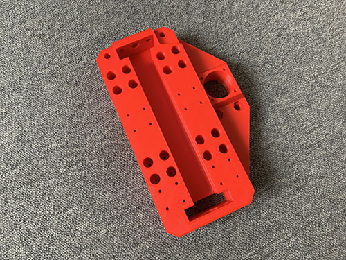
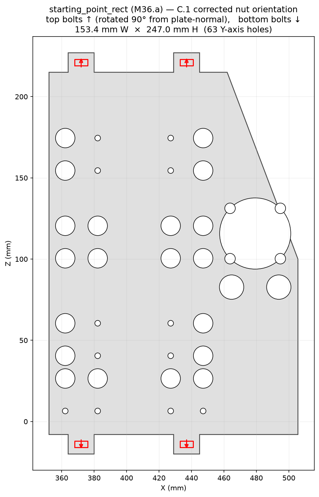
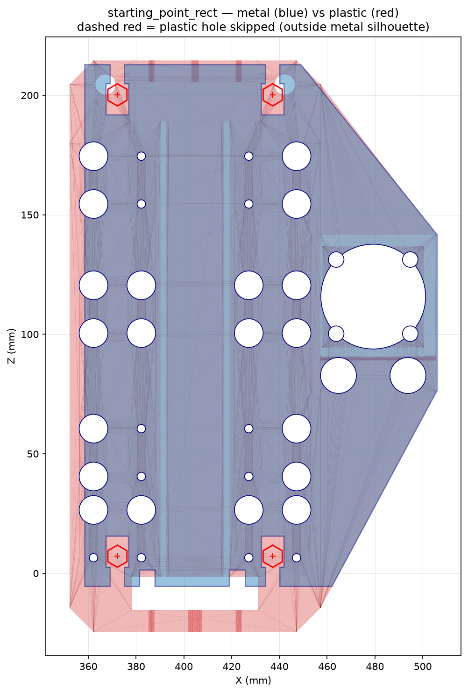
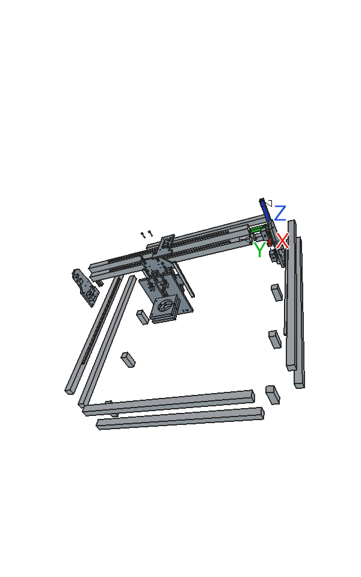
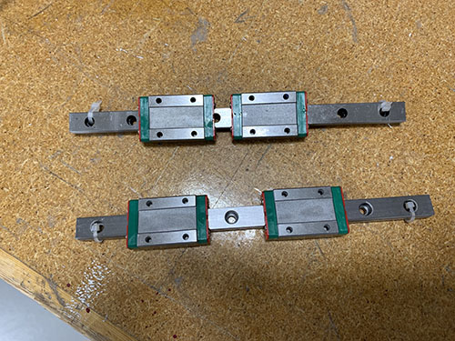
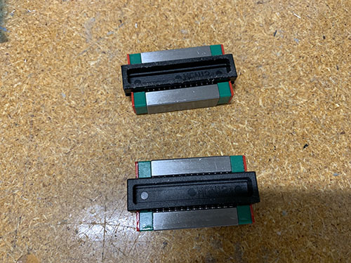
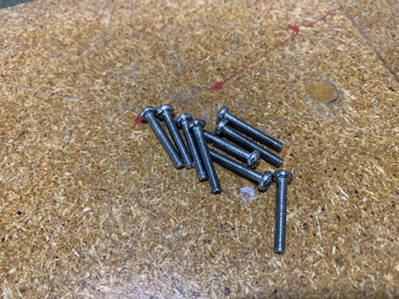
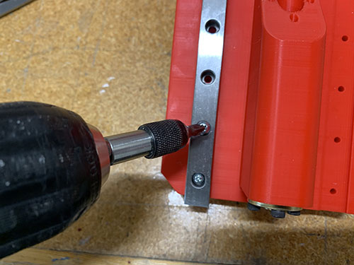
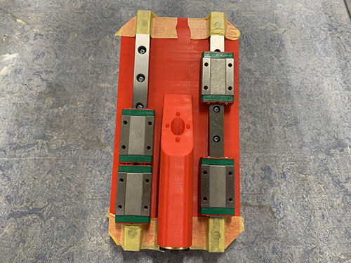

# IV. Engine plate p1of2

**M36.a** (engine_holder_vertical_plate_p1of2) is the gantry-fixed back plate of the Z-axis sub-assembly. It bolts to the front face of the carriage (**P07**) via four TAB EXTENSIONS and provides four mounting positions for the MGN12H blocks that the Z-sliding plate (M36.b) rides on.

## Components

**Metal replacement** — plastic part removed from this build:

| Code | Plastic original | Metal plan | Part | Qty | 3D object |
|------|-----------------|-----------|------|-----|-----------|
| M36.a | {.part-thumb} `carriage` | {.part-thumb} `M36a_plan` | vertical plate p1of2 — gantry-fixed back plate | 1 | `Engine_Holder_P1` |

`M36a_vs_plastic`

**Other components** — unchanged:

| Code | Part | Qty | 3D object |
|------|------|-----|-----------|
| O22   | MGN12H rail block (4× Z-axis, fixed to M36.a) | 4 | `MGN12H_Block_LL/LU/RL/RU` |
| N02   | M5 DIN 934 nut (p1of2 outtake tab bolts) | 4 | `Nut_P1_Top/Bot_*` |
| S12   | M5×20 mm screw (p1of2 tab bolts) | 4 | `Bolt_P1_Top/Bot_*` |
| S03   | M3×16 mm screw (MGN12H blocks to M36.a) | 16 | `BoltM3_Blk_*` |

## 3D view — stage 4

Stage 4 (frames 24–31) in the staged GIF covers all Z-axis components including M36.a and the four MGN12H blocks.

`cnc_assembly_staged_gif`

> Per-stage sub-GIF (frames 24–31 only) planned — RR-04.
> Per-component rotating GIF for M36.a planned — RR-03.

## p1of2 outtake tab bolts

M36.a has four TAB EXTENSIONS protruding beyond the plate's top and bottom edges. Each tab captures one M5 DIN 934 nut (**N02**). The bolt enters from above (top tabs, −Z) or below (bottom tabs, +Z) — this keeps bolt heads accessible at the plate edge rather than on the face.

**Tab world positions** (plate at x=137, y=−35, z=93, yaw=90°):

| Position | World Y (mm) | World Z (mm) | Bolt direction |
|----------|-------------|-------------|----------------|
| TL (top-left) | 337 | 314 | from above (−Z) |
| TR (top-right) | 402 | 314 | from above (−Z) |
| BL (bot-left) | 337 | 81 | from below (+Z) |
| BR (bot-right) | 402 | 81 | from below (+Z) |

Use 4× M5×20 mm screws (**S12**) and 4× M5 nuts (**N02**).

## MGN12H blocks to p1of2

Bolt all 4× MGN12H blocks (**O22**) to the **back face** of M36.a using 16× M3×16 mm screws (**S03**), 4 per block. The bolts enter from the block's outer face (−X direction). These blocks provide the Z-axis slide rails that M36.b rides on.

Block approximate world positions (with plate at yaw=+90°):

| Block | World Y centre (mm) | World Z centre (mm) |
|-------|---------------------|---------------------|
| LL (lower-left)  | 337 | 157 |
| LU (upper-left)  | 337 | 257 |
| RL (lower-right) | 402 | 157 |
| RU (upper-right) | 402 | 257 |

The plastic build photos below show the equivalent assembly step (P36 slider with rails — the block bolt pattern and dimensions are identical):

`assemble_carriage_9`

`assemble_carriage_10`

`assemble_carriage_11`

`assemble_carriage_12`

`assemble_carriage_13`

---

*Next: [V. Z-axis drive](05-z-axis-drive.md)*
