# V. Z-axis drive

**M40.a** (engine_holder_top_plate) sits above M36.a and holds the Z-axis NEMA17 stepper motor (**E11**). The motor drives the acme rod (**O02**) via a GT2 belt with a 16T motor pulley and 60T rod pulley, giving a ~3.75:1 torque step-up. Two M5 bolts through holes A and B lock M40.a down into M36.a after belt tensioning.

## Components

| Code | Part | Qty | 3D object | Metal change |
|------|------|-----|-----------|--------------|
| M40.a | engine holder top plate — Z stepper mount | 1 | `Top_Stepper_Holder` | **metal** replaces P40 |
| E11  | Bipolar NEMA17 stepper motor (no gear, 5 mm shaft) | 1 | — | unchanged |
| O14  | GT2 belt 6 mm wide 300 mm | 1 | — | unchanged |
| O15  | GT2 pulley 16T 5 mm bore (motor shaft) | 1 | — | unchanged |
| O16  | GT2 pulley 60T 8 mm bore (acme rod) | 1 | — | unchanged |
| O02  | Acme threaded rod 300 mm 8×8 mm | 1 | — | unchanged |
| O03  | Acme nut 8×8 mm | 1 | — | unchanged (integrated in M36.b) |
| O19  | KFL08 rod bearing 8 mm | 2 | — | unchanged (top & bottom of carriage P07) |
| S12  | M5×20 mm screw (M40.a holes A & B into M36.a) | 2 | `Bolt_TSH_*` | unchanged |
| S08  | M3×8 mm screw (Z-motor to M40.a) | 4 | — | unchanged |
| W06  | Washer 8×4×1 mm | 4 | — | unchanged |
| S16  | M8×80 mm screw (M40.a to carriage) | 2 | — | unchanged |
| N03  | M8 nut | 2 | — | unchanged |
| W04  | Washer 20×10×2 mm | 1 | — | unchanged |

## 3D view — stage 4

Stage 4 (frames 24–31) in the staged GIF includes M40.a and the Z stepper motor.

> Per-component rotating GIF for M40.a planned — RR-03.

## Component plan view

| Part | Plan view |
|------|-----------|
| M40.a — engine holder top plate |  |

## Z stepper motor, pulleys and belt

Attach the non-geared NEMA17 Z-axis stepper motor (**E11**) to **M40.a** using 4× M3×8 mm screws (**S08**) and 4× washers (**W06**). The motor cable connector should point toward the X-axis cable chain opening.

Attach 1× 16T GT2 pulley (**O15**) to the 5 mm motor shaft and 1× 60T GT2 pulley (**O16**) to the acme rod's 8 mm end. Lock both with set screws. The two pulleys must be at the same height and aligned so the belt runs straight.

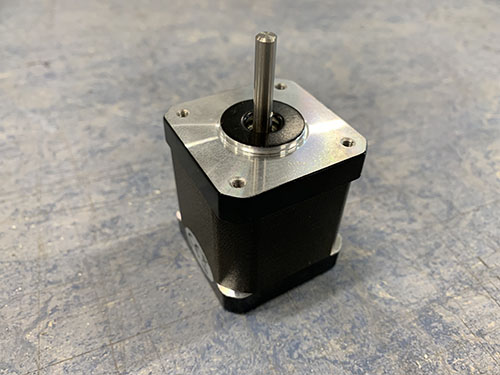

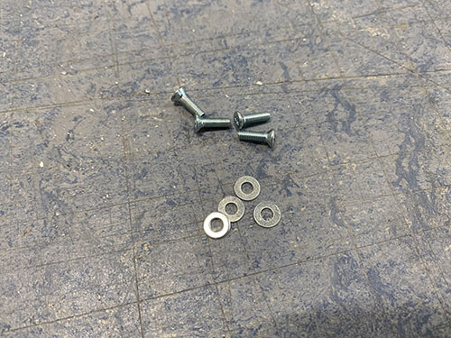

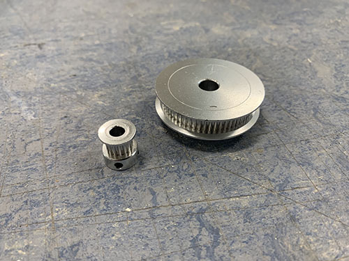

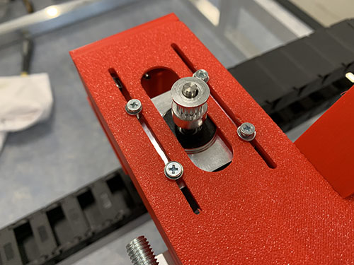

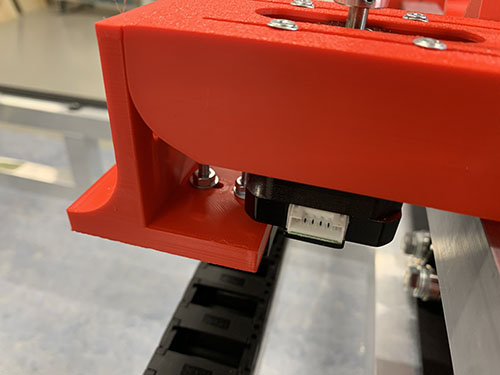

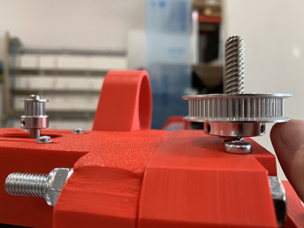

Loop the GT2 belt (**O14**) around both pulleys. Slide M40.a to tension the belt, then lock it with 2× M5×20 mm screws (**S12**) through holes A and B into M36.a. Belt should not be too loose or too tight.

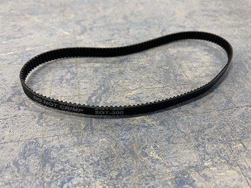

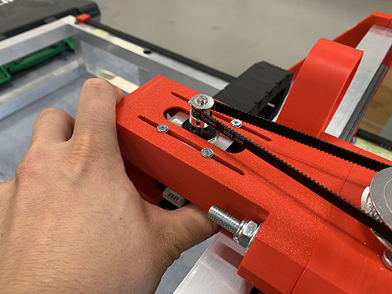

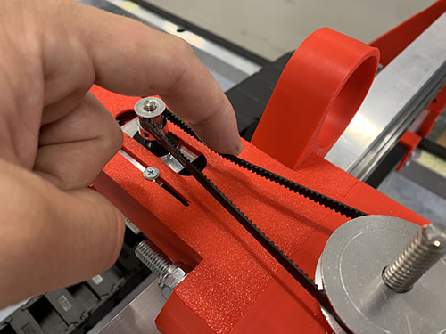

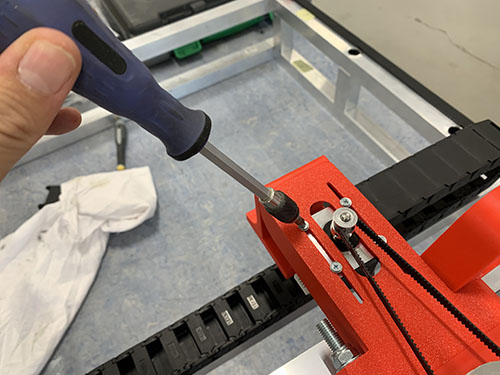

## X-axis cable chain and M40.a to carriage

First determine cable chain length: temporarily remove the X-axis belt to move the carriage freely across its full travel.

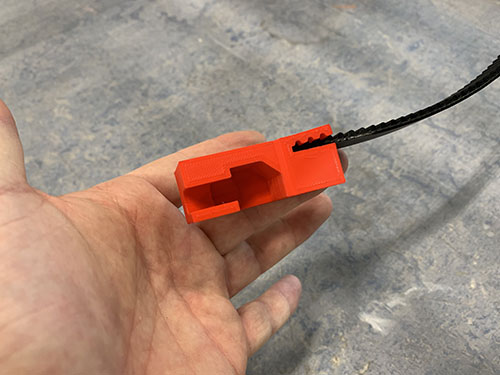

Attach the X-axis cable chain mount (**P38**) and **M40.a** to the carriage using 3× M4×25 mm screws (**S10**), M4 nuts (**N01**), and washers (**W01**). In the metal build, M40.a replaces P40; the mount holes and bolt pattern are the same.

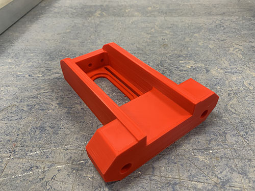

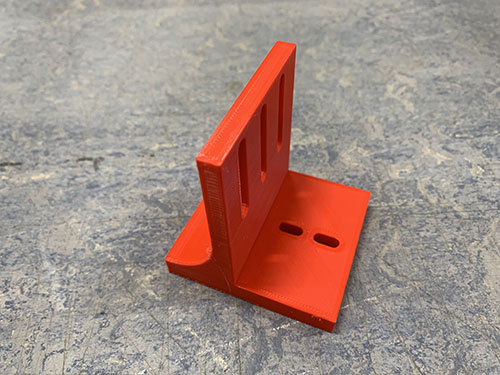

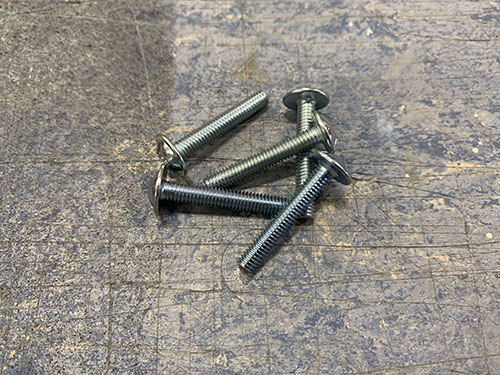

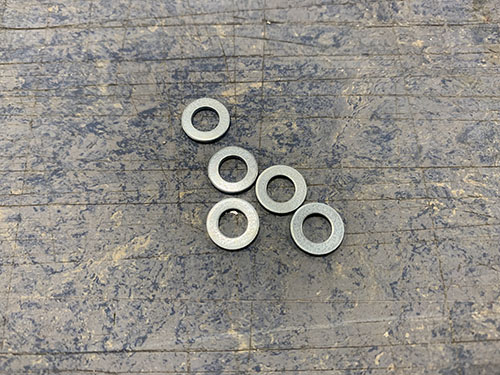

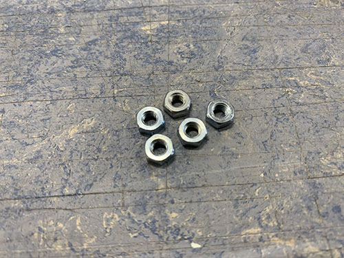

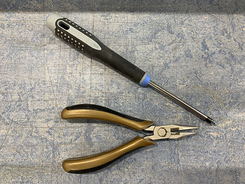

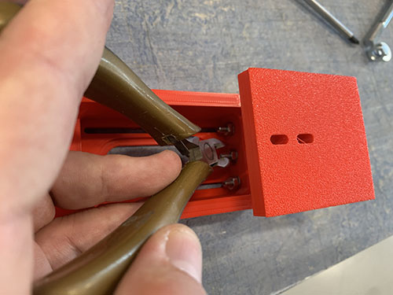

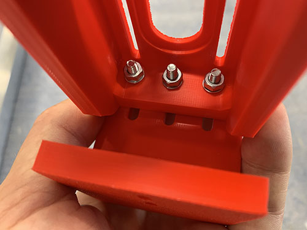

Attach M40.a to the carriage using 2× M8×80 mm screws (**S16**), M8 nuts (**N03**), and 1× washer (**W04**).

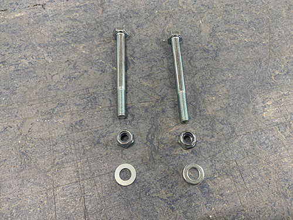

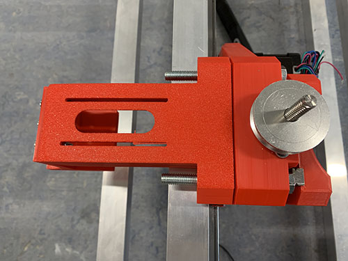

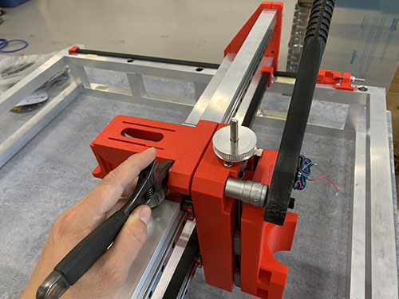

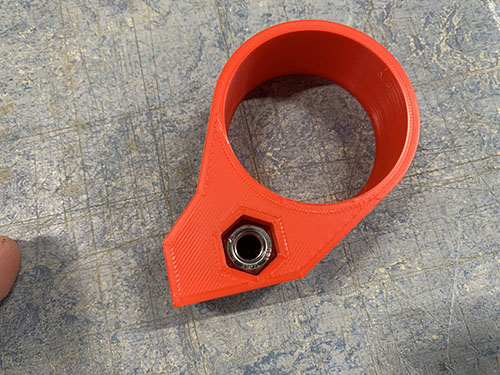

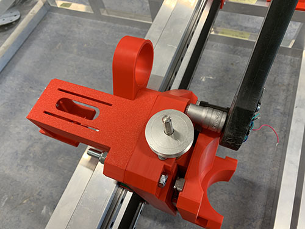

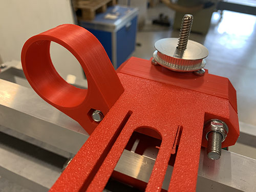

Clamp the cable chain (**O09**) to the mount and to the rear bridge beam. Move the carriage to both extremes — the chain must not touch the side plates. Remove links if needed (typically 3 links).

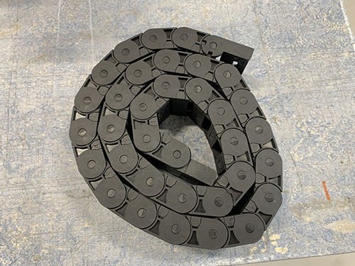

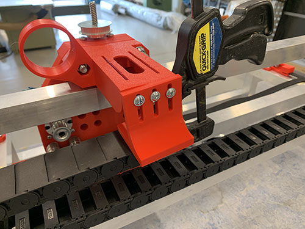

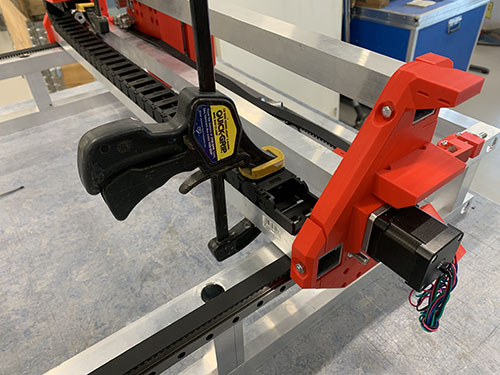

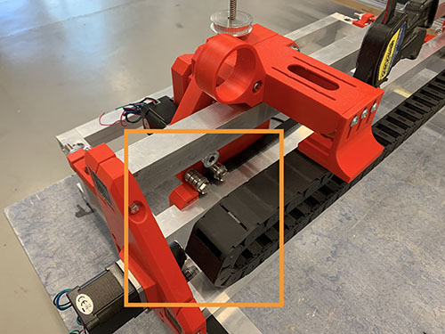

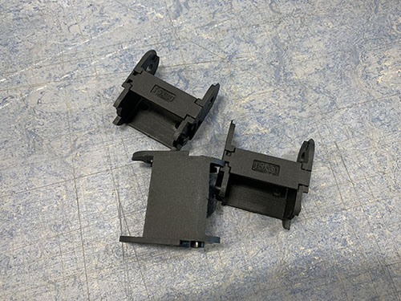

Disassemble the Z motor mount, properly bolt the chain to the mount with 2× M4×25 mm screws (**S10**), then reassemble.

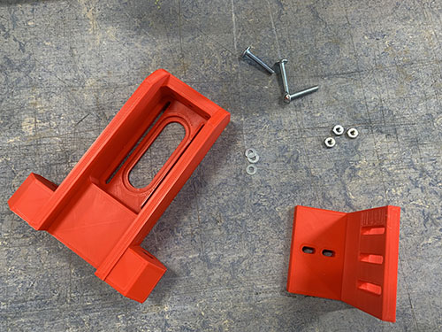

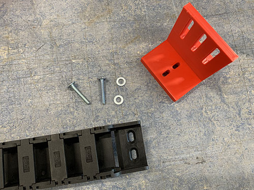

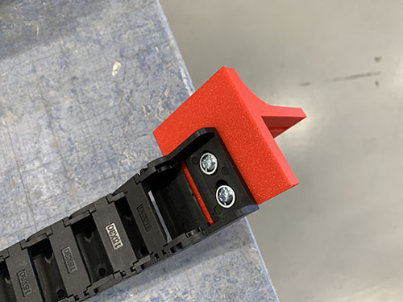

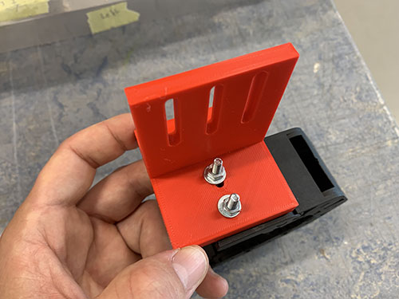

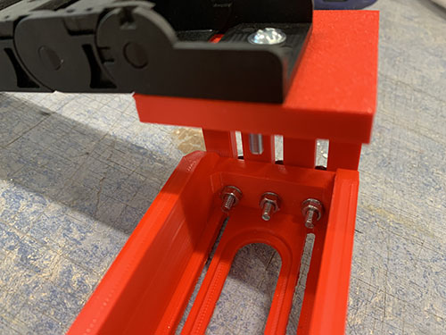

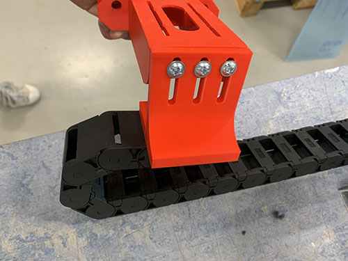

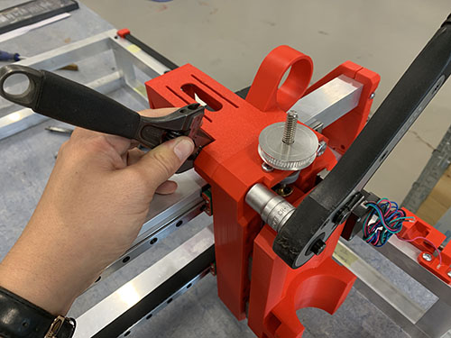

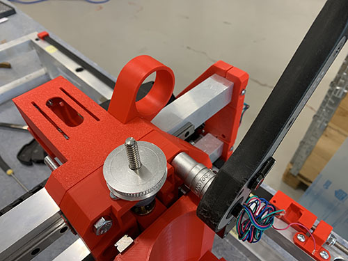

Move the carriage to its rightmost position and clamp the chain to the lower rear bridge beam. Centre-punch, drill 3 mm, tap M4, then fix with 2× M4×25 mm screws (**S10**).

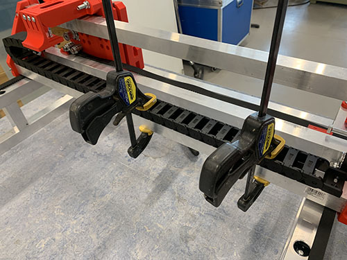

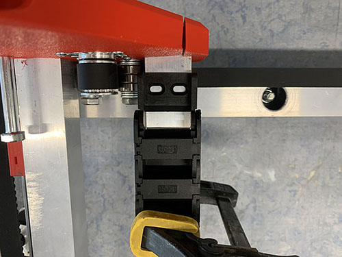

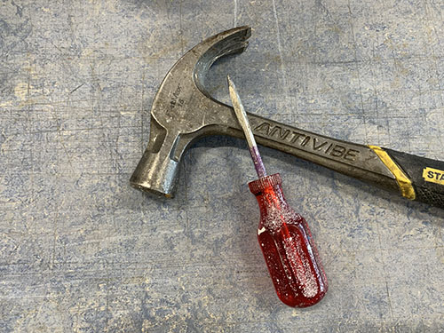

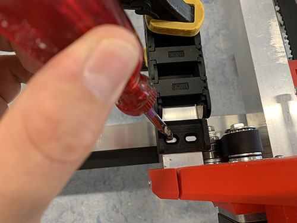

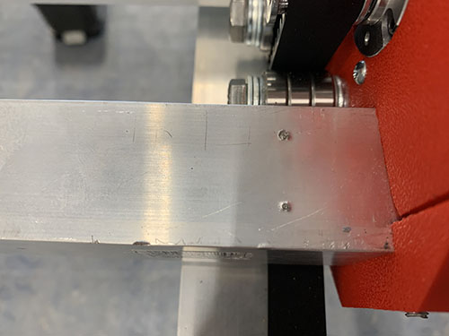

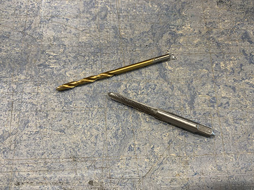

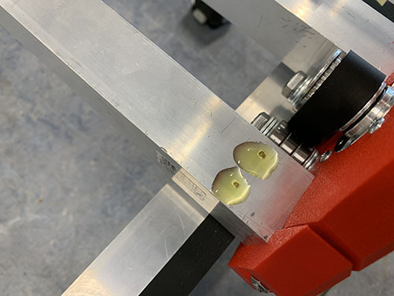

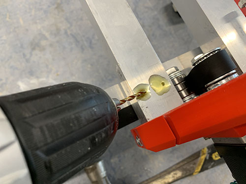

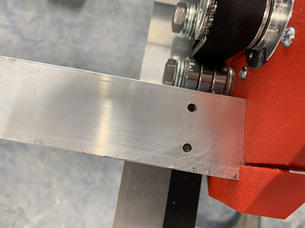

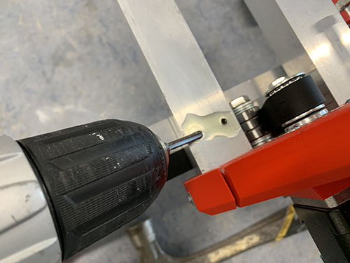

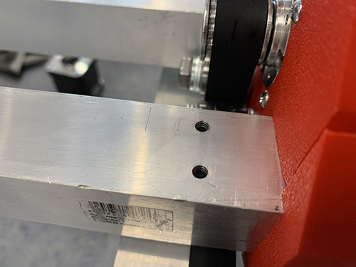

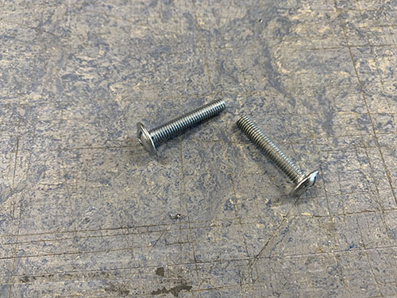

Reattach and tension the X-axis belt.

## Acme rod through bearings

Insert the acme rod (**O02**) down through the top KFL08 bearing (**O19**), through the acme nut (**O03**) in M36.b (see page VI), and into the bottom KFL08 bearing. Tighten the set screws on both bearings.

---

*Next: [VI. Engine plate p2of2 & router](06-engine-plate-p2of2.md)*
