# VI. Engine plate p2of2 & router clamps

**M36.b** (engine_holder_vertical_plate_p2of2) is the sliding front plate. It carries two 200 mm Z-axis MGN12H rails (**O20**) on its back face — these rails ride on the four blocks fixed to M36.a. On its front face, M36.b carries the Makita router via metal clamps (**M24.a/b**). The acme nut (**O03**) is integrated into M36.b, converting acme rod rotation into vertical travel.

## 3D sub-assembly — M36.b + Z-rails + M24.a/b router clamps

Exploded → assembled animation of **M36.b** with its Z-rails (O20), the two router clamps (**M24.a/b**), and their fasteners.

`cnc_subcomponent_VI_explode`
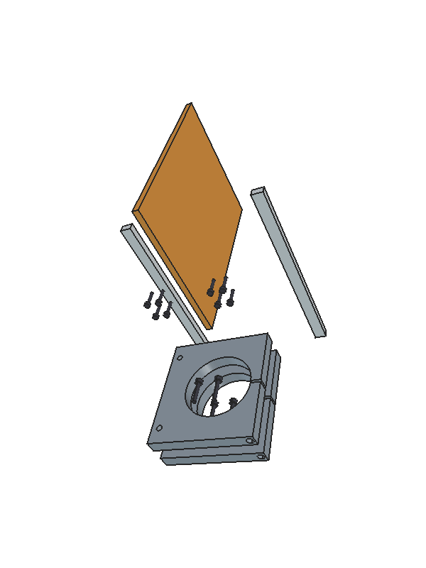

<video width="640" controls loop muted>
  <source src="../images/metal/subcomponents/cnc_subcomponent_VI_explode.mp4" type="video/mp4">
</video>

## Components

**Metal replacements** — plastic parts removed from this build:

| Code | Plastic original | Metal plan | Part | Qty | 3D object |
|------|-----------------|-----------|------|-----|-----------|
| M36.b | 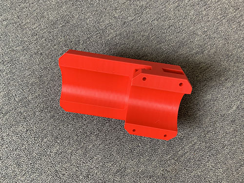{.part-thumb} `vertical_slider` | *(no plan PNG yet)* | vertical plate p2of2 — sliding front plate | 1 | `Engine_Holder_P2` |
| M24.a | 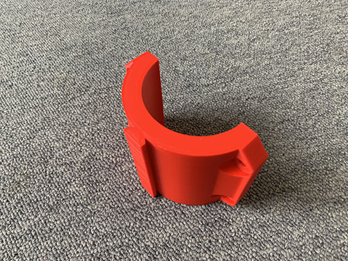{.part-thumb} `router_bracket` | {.part-thumb} `M24a_plan` | router clamp — bottom half | 1 | `Router_Clamp_Bottom` |
| M24.b | *(same P24 bracket, split into two halves)* | {.part-thumb} `M24b_plan` | router clamp — top half | 1 | `Router_Clamp_Top` |

**Other components** — unchanged:

| Code | Part | Qty | 3D object |
|------|------|-----|-----------|
| O20   | MGN12H linear rail 200 mm (Z-axis vertical) | 2 | `Rail_Z_Left`, `Rail_Z_Right` |
| O22   | MGN12H rail block (4× Z-axis, on O20 rails) | 4 | — |
| O03   | Acme nut 8×8 mm (integrated in M36.b) | 1 | — |
| E20   | Makita RT0700C(J) trimming router | 1 | — |
| E04   | 220V power plug | 1 | — |
| E05   | 220V power socket | 1 | — |
| S04   | M3×20 mm screw (Z-rails to M36.b back face) | 16 | `Bolt_P2_*_M3` |
| S05   | M3×25 mm screw (M36.b carriages to M36.a blocks) | 16 | — |
| S11   | M4×40 mm screw (router clamps) | 4 | `Bolt_RC_*_M4` |
| O11   | Cable ties | ~5 | — |
| O13   | Flexible conduit | ~0.5 m | — |

## 3D view — stage 4

Stage 4 (frames 24–31) in the staged GIF includes M36.b and the router clamps.

`cnc_assembly_staged_gif`

> Per-component rotating GIFs for M36.b, M24.a, M24.b planned — RR-03.

## Z-rails to p2of2

Remove the 4× MGN12H blocks (**O22**) from the 200 mm Z-rails (**O20**). Screw the rails to the **back face** of M36.b using 16× M3×20 mm screws (**S04**), 8 per rail. Slide the blocks back on and tape the ends to prevent them falling off.

`assemble_carriage_6_0`

`assemble_carriage_6`
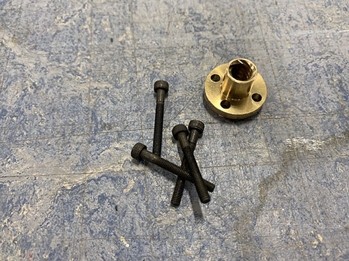

`assemble_carriage_7`
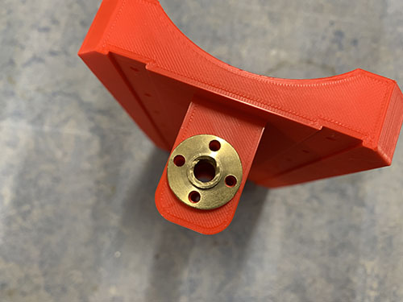

`assemble_carriage_8`
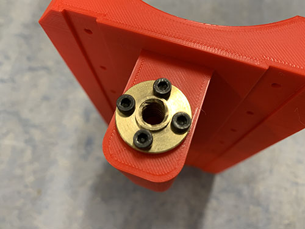

## p2of2 to M36.a block carriages

Align M36.b so its 4 MGN12H block carriages line up with the 4 blocks fixed to M36.a. The acme rod must pass through M36.b's acme nut (**O03**). Attach using 16× M3×25 mm screws (**S05**).

`assemble_carriage_17`
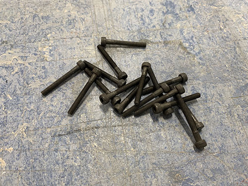

`assemble_carriage_18`
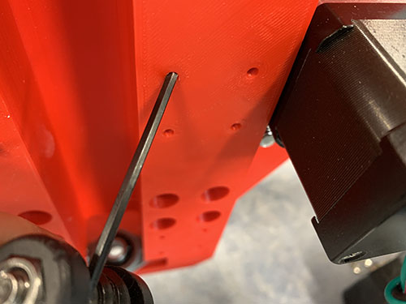

`assemble_carriage_19`
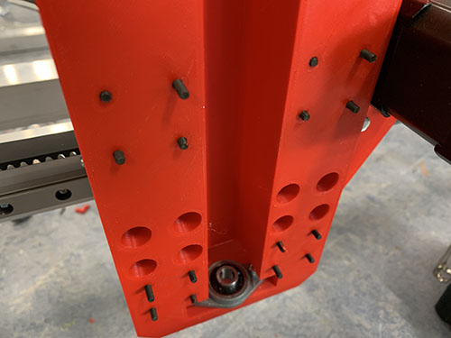

`assemble_carriage_20`
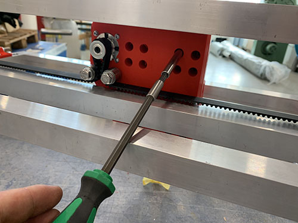

`assemble_carriage_21`
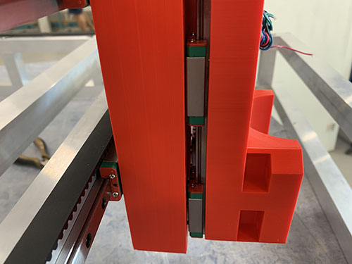

## Router clamps (M24.a/b)

The Makita router (**E20**) clamps to the **front face** of M36.b using metal clamp bottom half (**M24.a**) and top half (**M24.b**). Four M4×40 mm screws (**S11**) draw the clamps together around the router barrel through M36.b's front face.

In the plastic build, a single printed P24 bracket was used with M5 screws. The metal clamps use the same router barrel diameter but a different bolt pattern — refer to the 3D assembly GIF for exact bolt positions.

`attach_router_to_carriage_1`
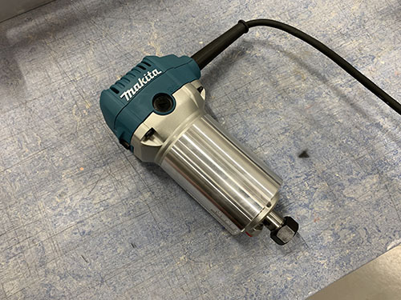

`attach_router_to_carriage_2`
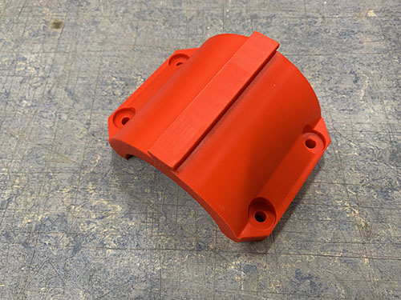

`attach_router_to_carriage_3`
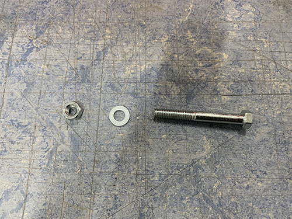

`attach_router_to_carriage_4`
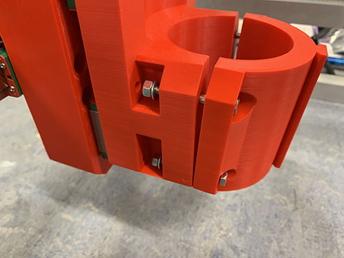

`attach_router_to_carriage_6`
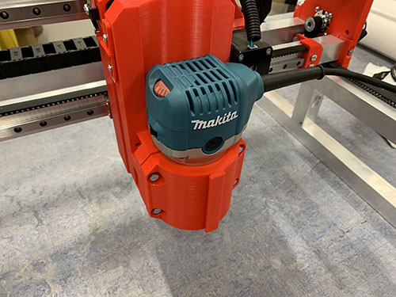

`attach_router_to_carriage_7`
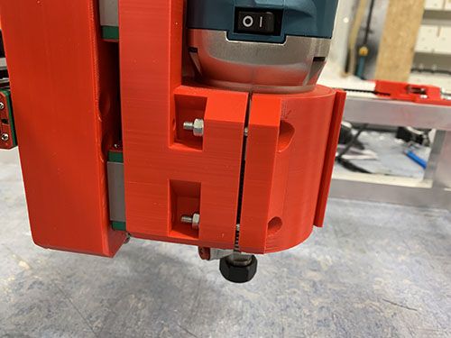

## Router cable management

!!! warning "High voltage"
    This section involves 220V wiring. Cable colours vary by region and component. Before connecting to mains power, consult a licensed electrician and verify compliance with local regulations.

To allow easy router replacement, fit a power plug (**E04**) and socket (**E05**) to the router cord. The cord runs through the X-axis cable chain alongside the stepper and end-stop cables.

Cut the router's power cord at a length that reaches behind the X-axis cable chain mount. Insert the section closest to the router into a flexible conduit (**O13**). Strip and solder the plug side.

`router_cable_management_23`
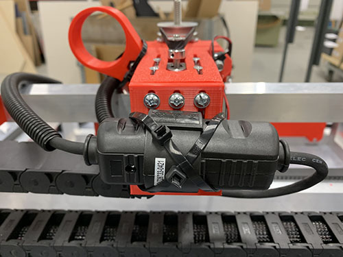

`router_cable_management_1`
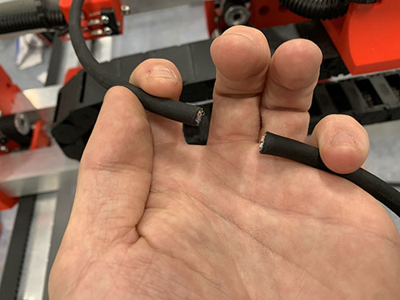

`router_cable_management_2`
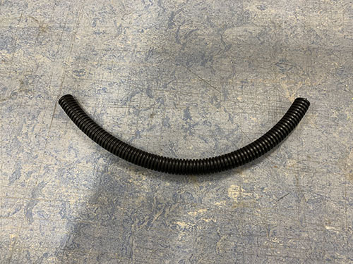

`router_cable_management_3`
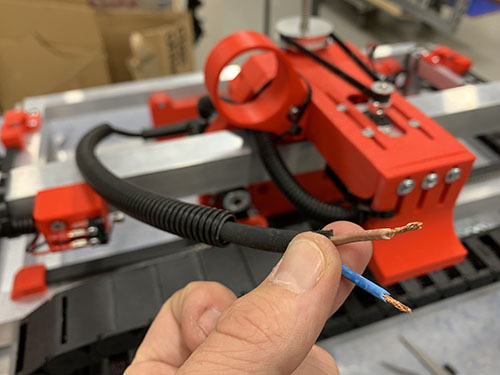

Wire and close the power plug:

`router_cable_management_4`
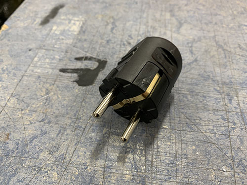

`router_cable_management_5`
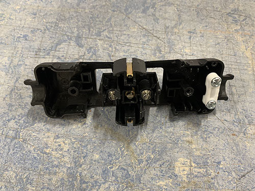

`router_cable_management_6`
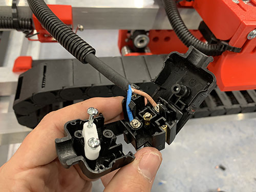

`router_cable_management_7`
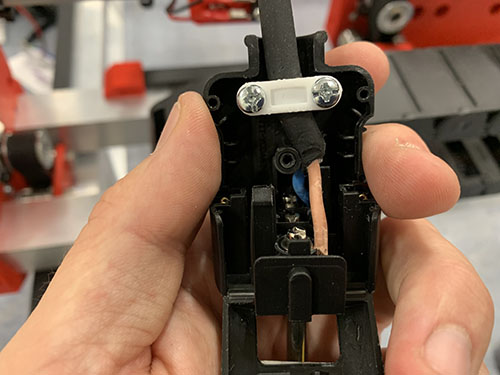

`router_cable_management_8`
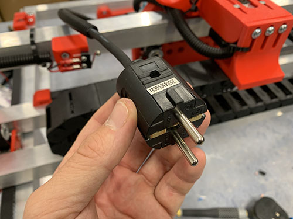

Thread the other end of the power cord through the Y-axis cable chain, around the left side plate, and through the X-axis cable chain. Use a cable tie (**O11**) as a pull-through hook for the rubber cable.

`router_cable_management_9`
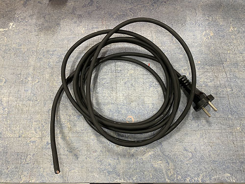

`router_cable_management_10`
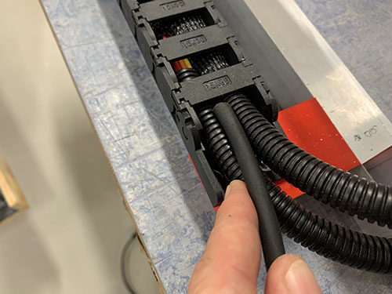

`router_cable_management_11`
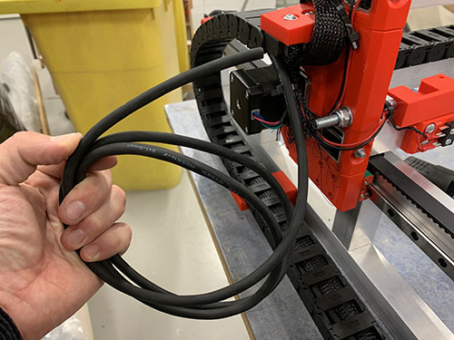

`router_cable_management_12`
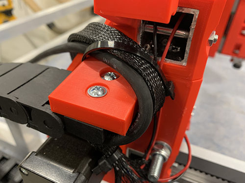

`router_cable_management_13`
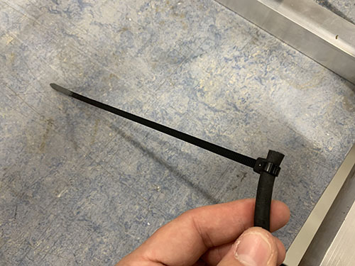

`router_cable_management_14`
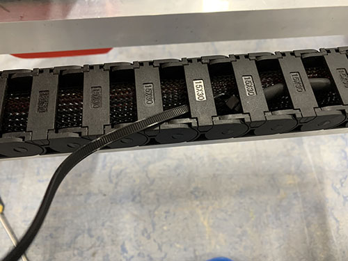

`router_cable_management_15`
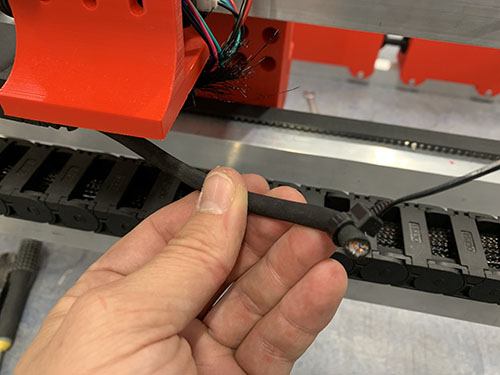

Strip the socket-side wires and connect to the power socket:

`router_cable_management_16`
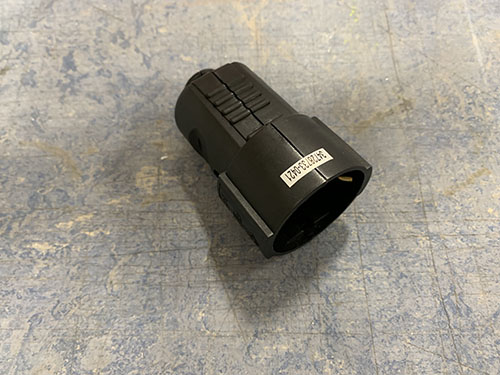

`router_cable_management_17`
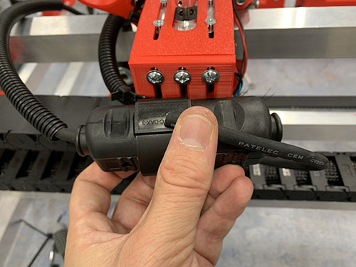

`router_cable_management_18`
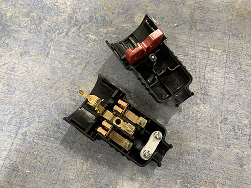

`router_cable_management_19`
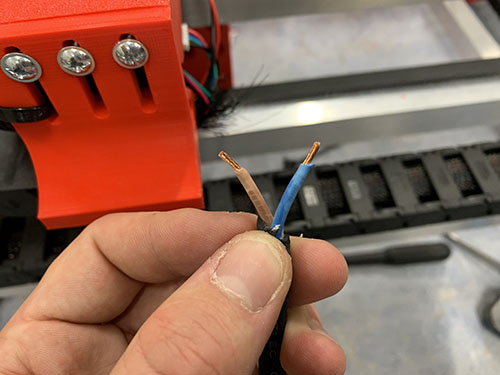

`router_cable_management_20`
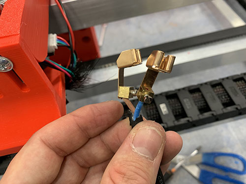

`router_cable_management_21`
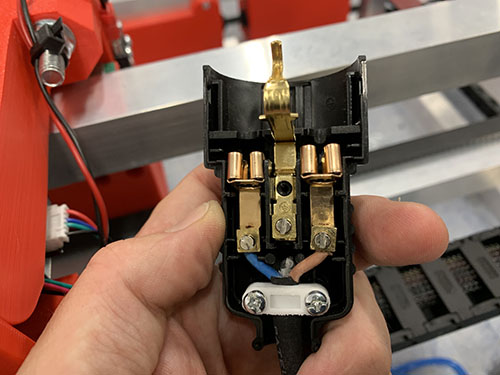

`router_cable_management_22`
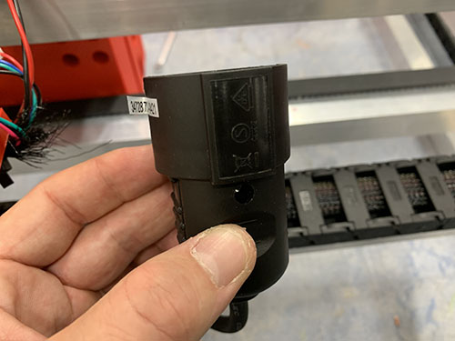

Strap the plug and socket to the back of the X-axis cable chain mount with cable ties. Strap the flexible conduit to the stepper motor conduit. Make sure the conduit does not drag along the upper bridge beam.

`router_cable_management_23`

`router_cable_management_24`
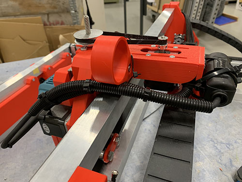

---

*Assembly complete. Return to [full assembly overview](index.md).*
