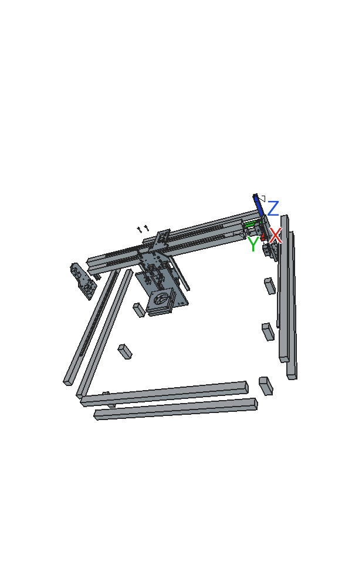
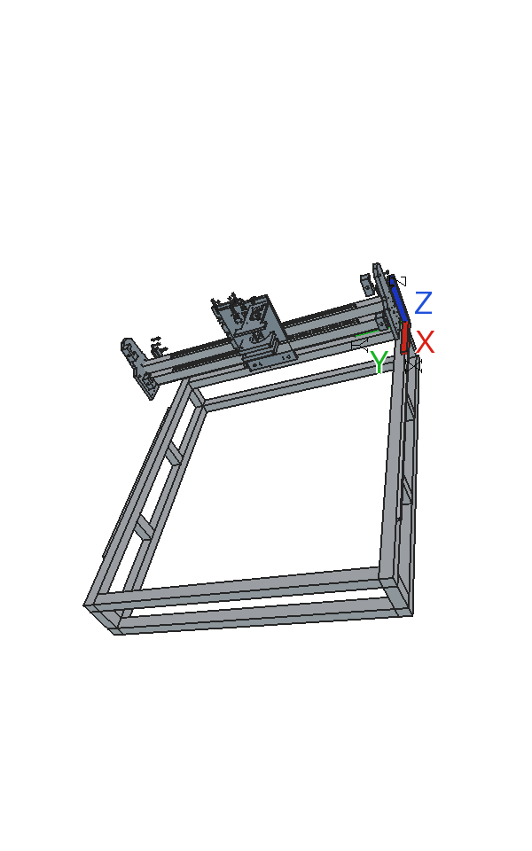

# Metal mod — full assembly

This page covers the complete CNC machine with all metal modifications. Follow the sub-assembly pages in order from I to VI.

## M-code identifier index

| M-code | Human name | Replaces | Script object | Note |
|--------|-----------|----------|---------------|------|
| M20.a | side plate left — body | P20 | `Side_Plate_Left` | metal |
| M20.b | side plate left — back clip | P21 | `Side_Plate_Back_Clip` | metal |
| M20.c | side plate left — lower front clip | P22 | `Side_Plate_Lower_Front_Clip` | metal |
| M20.d | side plate left — upper front clip | P23 | `Side_Plate_Upper_Front_Clip` | metal |
| M29.a | side plate right — body | P29 | `Side_Plate_Left_R` | metal, Y-mirror of M20.a |
| M29.b | side plate right — back clip | P30 | `Side_Plate_Back_Clip_R` | metal, Y-mirror of M20.b |
| M29.c | side plate right — lower front clip | P31 | `Side_Plate_Lower_Front_Clip_R` | metal, Y-mirror of M20.c |
| M29.d | side plate right — upper front clip | P32 | `Side_Plate_Upper_Front_Clip_R` | metal, Y-mirror of M20.d |
| M36.a | vertical plate p1of2 — gantry-fixed back plate | P07 (Z-face) | `Engine_Holder_P1` | metal |
| M36.b | vertical plate p2of2 — sliding front plate | P36 | `Engine_Holder_P2` | metal |
| M40.a | engine holder top plate — Z stepper mount | P40 | `Top_Stepper_Holder` | metal |
| M24.a | router clamp — bottom half | P24 (part) | `Router_Clamp_Bottom` | metal |
| M24.b | router clamp — top half | P24 (part) | `Router_Clamp_Top` | metal |
| MX.1  | engine sideways belt clamp | — (new) | `Engine_Sideways_Belt_Clamp` | metal, no plastic equivalent |

## 3D assembly animations

| Animation | Description |
|---|---|
|  | Staged assembly — 5 build stages |
|  | Explode / re-assemble |
|  | Kinematic — gantry travel + Z-slider |

## Sub-assembly pages

| Page | What it covers | Staged GIF frames |
|------|---------------|-------------------|
| [I. Aluminium frame](01-aluminium-frame.md) | Frame profiles (O07/O04/O06), Y-rails (O21) | Stage 1 (0–7) |
| [II. Side plates & Y-axis](02-side-plates.md) | M20/M29 side plates, Y motors (E18), HTD5M belts (O17) | Stage 2 (8–15) |
| [III. Gantry & X-axis](03-gantry.md) | Bridge beams (O05), carriage (P07), X motor (E18), HTD5M belt | Stage 3 (16–23) |
| [IV. Engine plate p1of2](04-engine-plate-p1of2.md) | M36.a, 4× MGN12H blocks (O22) | Stage 4 (24–31) |
| [V. Z-axis drive](05-z-axis-drive.md) | M40.a, Z stepper (E11), GT2 belt (O14), acme rod (O02) | Stage 4 (24–31) |
| [VI. Engine plate p2of2 & router](06-engine-plate-p2of2.md) | M36.b, Z-rails (O20), router clamps M24.a/b | Stage 4 (24–31) |
